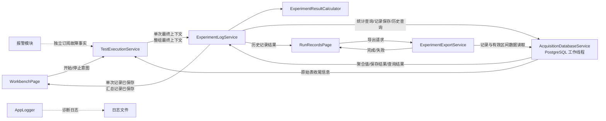
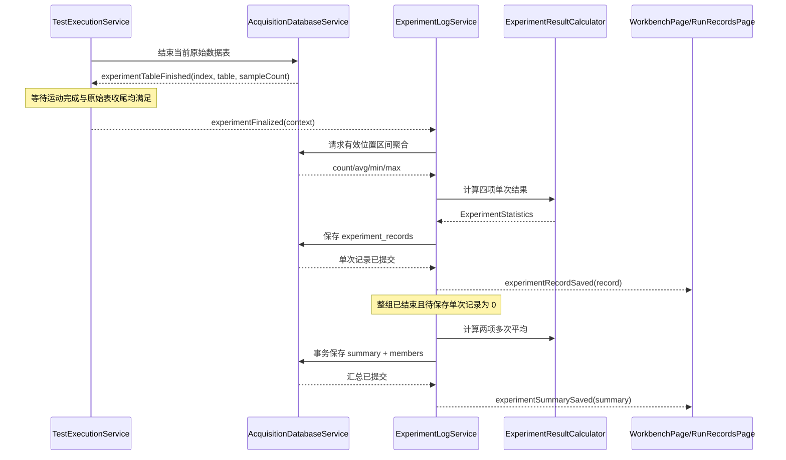

# 实验日志模块架构

## 1. 文档定位

本文根据 [LMEF-REQ-002《实验日志模块需求与报警边界》](../01-requirements/logging-module-requirements.md)定义实验日志模块架构，并同步记录分阶段实现状态。

本文定义模块职责、依赖方向、核心数据类型、数据库元数据结构、异步数据流、生命周期和异常边界。第二至第四阶段的单次记录、重复实验汇总、工作台结果绑定、历史查询和 Excel 导出已经完成源码实现与 Debug/Release 编译验证；数据库运行、自动化测试和报警模块仍未实现或验证。

## 2. 当前实现基础

### 2.1 已存在能力

- `TestExecutionService` 协调运动、采集和每次重复实验的数据表生命周期；
- `AcquisitionDatabaseService` 在独立线程维护 PostgreSQL 连接，每次重复实验创建一张七列原始数据表；
- 数据库服务在原始表创建和收尾时发布重复序号、表名和样本数；
- `TestResultService` 已保存目标值，并能根据平均涡流力和波动值计算波动率；
- `WorkbenchPage` 已有四张单次结果卡和两张汇总结果卡；
- `RunRecordsPage` 已有日期、关键词筛选区域、四列表格和导出按钮；
- `AppLogger` 已提供独立的 Qt 文件诊断日志。
- `ExperimentLogTypes` 已定义单次、整组、聚合和统计数据的跨线程类型；
- `ExperimentResultCalculator` 已实现四项单次统计和两项多次平均的纯计算；
- `TestExecutionService` 已携带内部执行标识、冻结参数、原始表名和样本数发布最终上下文；
- `AcquisitionDatabaseService` 已包含第一版固定元数据表的非破坏性初始化和版本保护；
- `ExperimentLogService` 已连接单次最终上下文、有效区间聚合、四项统计和单次记录幂等落库；
- `WorkbenchPage` 已按当前 `executionId` 消费成功落库的单次结果，更新四张单次结果卡；
- `RunRecordsPage` 已使用日期和关键词条件异步查询最终实验记录，并在表格行保存内部记录 ID；
- `ExperimentLogService` 已等待整组单次记录落库完成，计算两项多次平均并事务保存汇总及汇总明细关系；
- `WorkbenchPage` 已消费成功落库的汇总结果，更新两张最终实验结果卡；
- `ExperimentExportService` 已在独立工作线程中使用 QXlsx 分页生成单次或所属汇总工作簿；
- `RunRecordsPage` 已提供“导出选中实验”和“导出所属汇总”两个入口；
- QXlsx v1.5.1.1 已作为静态 `.xlsx` 读写依赖接入工程。

### 2.2 尚不存在或不完整的能力

- 纯计算组件、数据库读写和 UI 映射尚未通过自动化或 PostgreSQL 运行测试；
- 当前结果服务没有按重复序号保存多次单次结果；
- 固定元数据表初始化、单次记录落库和历史查询尚未通过脱机 PostgreSQL 运行验证；
- 汇总列表和独立汇总详情页面尚未实现；当前通过任一单次实验记录导出其所属汇总；
- Excel 导出尚未通过大数据量、磁盘写满和目标文件冲突运行测试；
- 当前界面只静态显示“现场操作员”，没有可提供真实操作员身份的会话服务。

## 3. 架构目标和非目标

### 3.1 架构目标

1. 每次实际实验最终结束后只形成一条持久化流程记录；
2. 原始采样数据继续使用现有动态七列表，不改变采集写入路径；
3. 使用固定元数据表保存完整记录和汇总，UI 只消费关键字段；
4. 统计计算、数据库读写和 Excel 导出不得阻塞 UI、ACS 通信或运动控制线程；
5. 工作台和历史记录页面通过业务服务订阅数据，不直接组合数据库、采集和运动状态；
6. 报警生命周期与实验日志分离，只通过实验名称共享用户可见上下文；
7. 失败、停止、迟到回调和重复通知不得产生重复或串组记录。

### 3.2 非目标

- 不记录登录、自检、参数修改、连接变化和报警确认等通用操作事件；
- 不建立通用审计日志或事件回放系统；
- 不修改 ACS 程序、采集块协议或设备安全策略；
- 不在实验日志模块中实现报警确认、恢复和关闭；
- 不在第一阶段重命名或拆分现有 `AcquisitionDatabaseService`；
- 不在日志模块内自研 Excel 文件格式，也不修改 QXlsx 上游源码。

## 4. 总体模块结构



依赖规则：

- UI 可以依赖实验日志服务和导出服务；
- 实验日志服务可以依赖流程业务事件、纯计算组件和数据库服务；
- 数据库服务不得依赖 UI；
- 实验日志服务不得控制运动、采集或安全联锁；
- 报警模块不得通过实验日志服务确认或解除故障；
- `AppLogger` 与实验日志数据库互不替代。

## 5. 模块职责

### 5.1 `TestExecutionService`

保留实验流程唯一所有者职责，并最小扩展为：

- 每组实验开始时生成内部 `executionId`；
- 冻结本组 `TestParameters`，后续记录不得读取已修改配置；
- 为每次重复实验维护重复序号、实验名称、原始数据表名和终止原因；
- 只有在运动完成条件和原始表收尾条件均满足后，发布单次完成事件；
- 停止或故障时先安全清理设备和采集，再发布一次最终停止或失败事件；
- 整组流程确定结束时发布整组最终事件；
- 保留上下文直到对应最终事件发布，不能在异步收尾前提前清空。

流程服务不负责统计、写实验日志表、历史查询和 Excel 导出。

### 5.2 `ExperimentLogService`

新增业务服务，负责：

- 接收单次实验和整组实验最终上下文；
- 根据原始表名请求有效位置区间聚合；
- 调用纯计算组件生成四项单次结果；
- 组装单次流程记录并异步持久化；
- 等待本组单次记录全部完成持久化后生成汇总；
- 组装汇总记录及汇总明细关系并以事务保存；
- 对 UI 发布“已成功保存”的记录，不用未落库临时值冒充历史记录；
- 提供历史列表、单条详情和汇总详情查询入口；
- 对重复最终事件执行幂等检查；
- 报告记录生成或持久化失败，但不负责设备安全动作。

建议保持与现有服务一致的单例生命周期，由 `main.cpp` 显式初始化和关闭。

第二至第三阶段已实现单次上下文处理、有效区间聚合、四项统计、幂等单次落库、历史列表查询、整组汇总和汇总明细关系。单次记录保存失败时不生成不完整汇总，并通过失败信号明确报告。

### 5.3 `ExperimentResultCalculator`

新增无 `QObject`、无数据库和无 UI 依赖的纯计算组件，负责：

- 由有效样本聚合结果计算平均涡流力；
- 计算涡流力波动值；
- 使用本次冻结的测试速度计算涡流力系数；
- 计算涡流力波动率；
- 由有效单次结果计算两项多次平均；
- 对零速度、零平均值、非有限值和空样本返回空结果或明确错误。

该组件只计算，不执行显示精度舍入。数据库保存有效计算精度，UI 和导出层负责格式化。

### 5.4 `AcquisitionDatabaseService`

第一阶段复用现有数据库服务和工作线程，增加以下能力：

- 初始化并校验实验日志固定元数据表；
- 按原始表名和位置区间执行聚合查询；
- 插入单次实验流程记录；
- 以事务插入汇总记录及汇总明细关系；
- 按结束时间、关键词和分页条件查询历史记录；
- 按内部记录标识读取单次详情、汇总详情和有效区间原始数据；
- 发布异步查询、保存和失败结果。

原有动态原始表创建、块写入和收尾逻辑保持不变。所有 `QSqlDatabase` 操作仍只在现有数据库工作线程执行。

第一阶段不重命名该服务。若后续数据库职责继续扩展，可单独评估重命名为更通用的实验数据库服务，但不作为本模块实现前提。

### 5.5 `ExperimentExportService`

新增只读导出服务，负责：

- 接收内部记录标识和目标文件路径；
- 从数据库读取记录、统计结果及有效位置区间原始数据；
- 按只读全局精度配置格式化显示数值；
- 在非 UI 线程流式生成工作簿；
- 发布导出进度、完成路径和失败原因；
- 不修改实验记录、原始数据或报警记录。

当前工程已接入 QXlsx v1.5.1.1 作为 `.xlsx` 读写后端，固定提交 `8a13e1c86e5d4fb5e3b2fb09c7b632514f1d54ca`，采用 MIT 许可证，并通过 `QXlsx::QXlsx` 静态目标链接。`ExperimentExportService` 负责字段映射、每页 5000 条的有效区间数据读取、独立写入线程、`QSaveFile` 原子提交和错误呈现；QXlsx 上游源码未修改。

### 5.6 UI 页面

`WorkbenchPage`：

- 继续提交开始和停止意图；
- 订阅已计算的单次结果，更新四张单次卡片；
- 订阅已计算的汇总结果，更新两张最终卡片；
- 不读取原始实验表计算结果；
- 不直接写实验日志数据库。

`RunRecordsPage`：

- 复用现有日期、关键词、表格和导出按钮布局；
- 查询数据库中已落库的最终流程记录；
- 四列分别显示结束时间、操作员、状态摘要和实验名称；
- 根据内部记录标识请求详情和导出，不用实验名称作为数据库唯一键；
- 不显示实验过程中的实时中间状态。

第一阶段可继续使用现有 `QTableWidget` 异步填充数据，不强制引入新的表格模型。只有分页、排序或数据量证明有需要时，再评估 `QAbstractTableModel`。

## 6. 核心领域类型

建议在 `src/experimentlog/ExperimentLogTypes.h` 定义跨服务使用的强类型结构，并为跨线程 Qt 信号注册元类型。

```cpp
enum class ExperimentTerminalState
{
    Completed,
    Failed,
    Stopped
};

struct ExperimentStatistics
{
    qint64 effectiveSampleCount = 0;
    std::optional<double> averageForceNewtons;
    std::optional<double> forceCoefficientNewtonSecondsPerMeter;
    std::optional<double> forceRangeNewtons;
    std::optional<double> fluctuationRatePercent;
};

struct ExperimentFinalContext
{
    quint64 executionId = 0;
    int repetitionIndex = 0;
    int plannedRepeatCount = 0;
    QString baseExperimentName;
    QString experimentName;
    QDateTime finishedAtUtc;
    QString operatorName;
    ExperimentTerminalState state = ExperimentTerminalState::Failed;
    QString terminalReason;
    TestParameters parametersSnapshot;
    QString rawDataTableName;
    qint64 rawSampleCount = 0;
};
```

设计约束：

- `executionId` 是内部异步关联标识，不是用户业务批次，也不在普通 UI 展示；
- 实验名称只用于用户识别，不能作为唯一数据库键；同一电机型号和工件编号在不同时间再次实验时名称可能重复；
- 结束时间在流程进入最终状态时冻结，数据库保存为 UTC `TIMESTAMPTZ`，UI 转为本地时间显示；
- 可空统计值使用 `std::optional<double>`，不得用零值表达“无结果”；
- `parametersSnapshot` 至少冻结测试类型、测试速度、统计区间和重复次数；
- 操作员字段当前没有真实会话来源，架构预留字段但不能把静态 UI 文案当作可信身份。

## 7. 统计数据流

### 7.1 数据库聚合

原始表完成提交后，数据库线程按冻结的统计位置区间执行聚合：

```sql
SELECT COUNT(force_n), AVG(force_n), MIN(force_n), MAX(force_n)
FROM <validated_raw_table>
WHERE position_m BETWEEN :position_min AND :position_max;
```

要求：

- 原始表名必须来自数据库服务已创建的受信上下文，并再次通过标识符校验，不接受 UI 拼接 SQL；
- 位置参数使用绑定参数；
- 正反运动的区间使用规范化后的最小值和最大值，端点是否包含按最终需求确认；
- 聚合只在原始表收尾提交后执行；
- `COUNT` 作为有效样本数保存在元数据表，即使第一阶段 UI 不显示也可用于追溯；
- 大量原始数据不搬到 UI 线程进行统计。

### 7.2 派生计算

纯计算组件执行：

```text
平均涡流力       = AVG(force_n)
涡流力波动值     = MAX(force_n) - MIN(force_n)
涡流力系数       = 平均涡流力 / 冻结测试速度
涡流力波动率     = 涡流力波动值 / 平均涡流力 × 100%
```

测试速度无效时系数为空；平均涡流力无效或为零时波动率为空；没有有效样本时四项结果均为空。

## 8. PostgreSQL 数据架构

### 8.1 原始数据表

继续使用现有每次重复实验一张表的结构：

```text
relative_time_ms
acceleration_m_s2
velocity_m_s
motor_current
motor_temperature
force_n
position_m
```

实验日志模块不向原始表增加元数据列，而是在固定表中保存原始表名引用。

### 8.2 `experiment_records`

建议固定表至少包含：

| 字段 | 类型建议 | 说明 |
|---|---|---|
| `id` | `BIGSERIAL` | 内部记录标识 |
| `execution_id` | `BIGINT` | 内部整组执行关联标识 |
| `experiment_name` | `TEXT` | 用户可见实验名称，不要求全局唯一 |
| `base_experiment_name` | `TEXT` | `motorModel + specimenId` 的快照名称 |
| `repetition_index` | `INTEGER` | 重复序号 |
| `planned_repeat_count` | `INTEGER` | 计划重复次数 |
| `finished_at` | `TIMESTAMPTZ` | 实验最终结束时间 |
| `operator_name` | `TEXT NULL` | 操作员来源确认前允许为空 |
| `terminal_state` | `TEXT` | `completed/failed/stopped` |
| `terminal_reason` | `TEXT NULL` | 失败或停止原因 |
| `test_speed_m_s` | `DOUBLE PRECISION` | 冻结测试速度 |
| `statistics_start_m` | `DOUBLE PRECISION` | 统计位置起点 |
| `statistics_end_m` | `DOUBLE PRECISION` | 统计位置终点 |
| `raw_sample_count` | `BIGINT` | 原始表样本数 |
| `effective_sample_count` | `BIGINT` | 参与统计样本数 |
| `average_force_n` | `DOUBLE PRECISION NULL` | 平均涡流力 |
| `force_coefficient_n_s_m` | `DOUBLE PRECISION NULL` | 涡流力系数 |
| `force_range_n` | `DOUBLE PRECISION NULL` | 波动值 |
| `fluctuation_rate_percent` | `DOUBLE PRECISION NULL` | 波动率 |
| `raw_data_table_name` | `TEXT NULL` | 原始数据表引用 |
| `parameters_snapshot` | `JSONB` | 本次冻结配置快照 |

唯一约束建议使用 `(execution_id, repetition_index)`，而不是 `experiment_name`。

### 8.3 `experiment_summaries`

建议固定表至少包含：

- 内部 `id` 和唯一 `execution_id`；
- 基础实验名称、结束时间、操作员和汇总状态；
- 计划次数、已形成记录数、完成/失败/停止次数；
- 有效汇总次数；
- 多次平均涡流力和多次平均涡流力系数；
- 未参与汇总说明。

### 8.4 `experiment_summary_members`

使用关系表保存汇总包含的单次实验记录，本文称为“汇总明细关系”：

| 字段 | 说明 |
|---|---|
| `summary_id` | 汇总记录外键 |
| `experiment_record_id` | 单次记录外键 |
| `repetition_index` | 稳定排序 |
| `included_in_average` | 是否参与多次平均 |
| `exclusion_reason` | 未参与原因 |

不把实验名称列表拼成单个文本字段；查询时通过关系表恢复列表。

## 9. 正常流程时序



关键顺序约束：

1. 原始表收尾提交先于统计聚合；
2. 单次元数据提交成功后才向历史 UI 宣布记录可用；
3. 汇总必须等待本组所有应形成的单次记录保存完成；
4. UI 更新失败不能回滚已提交数据库记录；
5. 数据库统计或日志保存失败不能阻止设备侧停止和安全清理。

## 10. 停止、失败和幂等处理

### 10.1 用户停止

- 流程服务先停止运动和采集并排空已接收数据；
- 原始表能够正常收尾时，发布 `Stopped` 最终上下文；
- 日志服务保存已有有效统计结果和停止原因；
- 原始表尚未建立且实际实验未开始时，不形成单次流程记录；
- 整组确定不再继续后形成停止或部分完成汇总。

### 10.2 流程失败

- 首个根因由流程服务冻结，后续清理错误作为诊断信息附加；
- 硬件和采集安全清理优先于实验日志写入；
- 原始表可读时尽量生成有效区间统计，无法生成的字段为空；
- 实验日志只保存最终状态和简要原因；完整报警生命周期由报警模块保存；
- 实验日志持久化本身失败时，发布明确失败信号并写诊断日志，不伪装成保存成功。

### 10.3 幂等与迟到结果

- 所有异步命令和结果携带 `executionId + repetitionIndex`；
- 唯一约束阻止同一执行中的同一重复序号产生两条记录；
- 重复且内容一致的最终通知可以视为幂等成功；
- 重复但内容冲突时报告数据一致性错误，不覆盖第一条最终记录；
- 已结束执行的迟到统计、保存或 UI 回调不得写入新执行；
- 汇总记录按唯一 `executionId` 保证只形成一次。

## 11. 历史查询与 UI 映射

### 11.1 查询接口

建议业务查询输入：

```cpp
struct ExperimentRecordFilter
{
    QDate fromDate;
    QDate toDate;
    QString keyword;
    int offset = 0;
    int limit = 100;
};
```

关键词匹配实验名称、操作员、状态和终止原因。日期范围作用于 `finished_at`，查询默认按结束时间倒序。

### 11.2 列表映射

| `RunRecordsPage` 列 | 数据字段 |
|---|---|
| 时间 | `finished_at` 转本地时间 |
| 操作员 | `operator_name`；无可信来源时显示 `--` |
| 操作内容 | 由 `terminal_state + terminal_reason` 生成状态摘要 |
| 关联实验 | `experiment_name` |

表格行内部保存 `experiment_records.id`，详情和导出按内部 ID 请求，避免同名实验误选。

### 11.3 工作台映射

- `experimentRecordSaved` 更新平均涡流力、涡流力系数、波动值和波动率卡片；
- `experimentSummarySaved` 更新多次平均涡流力和多次平均涡流力系数卡片；
- 空统计值统一显示 `----`；
- 新组开始时只清空当前卡片，不删除数据库历史记录；
- 显示精度来自同一个只读格式配置，禁止各页面自行硬编码不同小数位。

## 12. Excel 导出架构

### 12.1 单次实验导出

导出服务按内部记录标识读取：

- 单次实验完整元数据；
- 四项统计结果；
- 原始表中统计有效位置区间内的采样数据；
- 需求要求的其他原始数据范围。

工作簿使用一个 `实验数据` 标签页：顶部为实验信息和结果，下方为采样数据。

### 12.2 汇总导出

- `汇总结果` 标签页保存汇总元数据和两项多次平均；
- `实验列表` 标签页保存成员实验状态和四项单次结果；
- 若确认需要原始数据，仅导出各实验有效位置区间数据，并采用分页/流式读取；
- 不导出通用运行事件、批次字段或报警记录。

### 12.3 线程与资源约束

- 工作簿生成不得在 UI 线程执行；
- 原始数据按页读取，不一次性加载全部实验数据；
- 当前导出过程不修改数据库；取消进行中的导出任务仍属于后续增强；
- 失败文件应关闭句柄并删除不完整临时文件，再以原子重命名提交最终文件；
- 目标文件已存在时必须由用户明确选择覆盖或更名。

## 13. 与报警模块的边界

报警模块与实验日志服务不形成相互控制依赖：

- 流程服务或设备服务分别向两个模块发布所需事实；
- 实验日志保存实验最终状态、统计结果和简要终止原因；
- 报警模块保存等级、来源、内容、确认状态和恢复时间；
- 报警确认和恢复不写实验流程记录；
- 实验结果偏离目标值默认不是设备报警；
- 报警导致实验终止时，两边使用相同实验名称提供用户可见关联；
- 第一阶段不导出报警记录；
- 报警确认不得改变实验历史记录或设备实际健康状态。

报警模块尚未实现时，实验日志模块只保存流程提供的终止原因，不预先定义报警服务 API。

## 14. 初始化与关闭

### 14.1 初始化顺序

建议：

1. 初始化 `AppLogger`；
2. 初始化运动和采集服务；
3. 初始化 `AcquisitionDatabaseService` 并创建缺失的实验日志表；
4. 初始化 `ExperimentLogService`，连接流程和数据库异步结果；
5. 初始化 `ExperimentExportService`；
6. 创建或绑定 UI；
7. 连接控制器。

数据库不可用或实验日志表初始化失败时，禁止开始新实验，但 UI 应能明确显示原因。

### 14.2 关闭顺序

建议：

1. `TestExecutionService::shutdown()` 停止活动流程并优先完成安全清理；
2. `ExperimentLogService::shutdownAndFlush(timeout)` 停止接收新上下文并等待已排队元数据写入；
3. 取消或完成导出任务并关闭文件；
4. 关闭采集服务；
5. 关闭数据库服务和工作线程；
6. 关闭运动服务；
7. 关闭文件诊断日志。

日志刷新超时不得跳过运动和采集安全关闭；应记录未完成写入并继续安全退出。

## 15. 建议源码组织

第一阶段新增文件控制在必要范围：

```text
src/experimentlog/
├── ExperimentLogTypes.h
├── ExperimentResultCalculator.h
├── ExperimentResultCalculator.cpp
├── ExperimentLogService.h
├── ExperimentLogService.cpp
├── ExperimentExportService.h
└── ExperimentExportService.cpp
```

现有文件的最小调整范围：

- `TestExecutionService`：增加内部执行标识、稳定最终上下文和单次/整组最终信号；
- `AcquisitionDatabaseService`：增加固定表、聚合、记录 CRUD 和导出读取命令；
- `WorkbenchPage`：消费实验日志结果信号，不自行计算或持久化；
- `RunRecordsPage`：由静态示例数据改为异步查询和选中记录导出；
- `main.cpp`：显式构造实验日志和导出服务；导出工作线程由服务析构时确定性关闭；
- `CMakeLists.txt`：登记新增源码，并通过 `QXlsx::QXlsx` 链接已确认的 Excel 读写依赖。

不建议第一阶段额外引入仓储接口、插件系统、消息总线或第二套 PostgreSQL 线程。

## 16. 验证策略

### 16.1 纯计算测试

- 正常平均值、极差、系数和波动率；
- 空样本、零速度、零平均值、非有限值；
- 多次平均包含和排除规则；
- 计算不受显示精度配置影响。

### 16.2 数据库集成测试

- 第一版固定表初始化和版本检查；
- 原始表按位置区间聚合；
- 单次记录唯一约束和幂等写入；
- 汇总与汇总明细关系的事务原子性；
- 日期、关键词、分页和倒序查询；
- 同名实验在不同 `executionId` 下可以共存；
- 数据库断开后不发布虚假的保存成功。

### 16.3 流程集成测试

- 每次重复只产生一条完成记录；
- 用户停止、运动故障、采集故障和数据库故障；
- 原始表收尾晚于运动完成和运动完成晚于原始表收尾；
- 迟到回调不会写入下一组实验；
- 汇总等待所有应形成的单次记录；
- UI 只在结果属于当前执行时更新。

### 16.4 UI 和导出测试

- 四列字段映射、空操作员、失败原因和同名实验；
- 当前卡片和汇总卡片更新；
- 单次与汇总导出字段、精度和有效区间数据；
- 大数据量分页、取消、磁盘写满和目标文件冲突。

上述测试应先使用脱机数据库和模拟流程完成。真实设备运行需按工业软件两阶段确认另行执行。

## 17. 风险和待确认决策

### 17.1 实现前必须确认

1. 操作员身份的真实来源；当前代码只有静态 UI 文案；
2. 统计区间端点规则和位置单位；
3. 多次平均是否只包含正常完成记录，以及是否允许人工排除；
4. 汇总状态“部分完成”的业务定义；
5. 汇总导出包含哪些有效区间原始数据；
7. 数据库、采集和数据处理错误进入报警模块的分级规则；
8. 实验日志固定表由程序自动创建还是由部署脚本预创建。

### 17.2 已识别风险

- 基础实验名称只由电机型号和工件编号组成，跨时间可能重名，因此必须使用内部记录标识和 `executionId` 保证正确关联；
- 当前失败流程过早清理上下文，直接接日志会丢失重复序号和原始表名；
- 原始表提交与元数据提交不是一个长事务，程序异常退出可能留下没有元数据的孤立原始表；第一阶段应至少提供诊断检查，不应自动删除；
- 当前 `TestResultService` 是工作台成员且只保存一份结果，不能直接承担多次实验汇总和持久化；
- 当前 `RunRecordsPage` 已接异步查询和数据库错误提示，但一次最多显示 100 条，尚无翻页控件和详情页；
- Excel 导出已分页读取数据库并使用原子文件提交，但 QXlsx 工作簿模型仍会随导出行数增长占用内存，需要通过大数据量运行测试确定上限；
- 操作员字段在身份服务建立前不可作为审计证据。

## 18. 分阶段实施建议

1. 第一阶段：增加领域类型、流程最终上下文、固定元数据表和纯计算组件；源码和 Debug/Release 编译已完成，自动化与数据库运行验证待 Stage 2；
2. 第二阶段：实现单次统计、持久化、工作台卡片更新和历史列表查询；源码和 Debug/Release 编译已完成，数据库运行与自动化验证待独立测试确认；
3. 第三阶段：实现汇总记录、汇总明细关系和两项多次平均；源码和 Debug/Release 编译已完成，数据库运行与自动化验证待独立测试确认；
4. 第四阶段：基于已接入的 QXlsx 实现单次和所属汇总导出；源码和 Debug/Release 编译已完成，文件生成与大数据量验证待独立测试确认；
5. 第五阶段：报警模块就绪后验证同一实验名称下的跨模块追溯。

每一实施阶段进入源码修改和编译前需单独确认；测试、可执行程序启动和真实设备运行需按独立测试范围再次确认。
