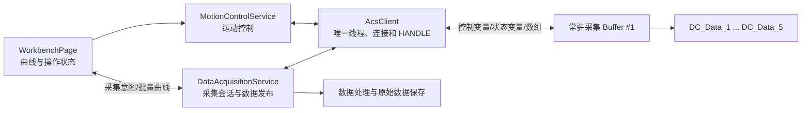
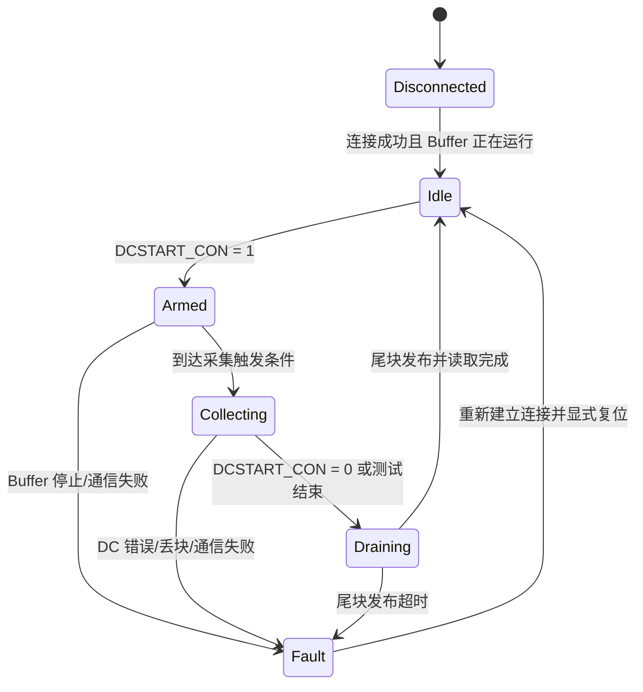

# ACS 常驻环形块数据采集模块设计

## 1. 文档状态

- 文档用途：定义 ACS 常驻数据采集 Buffer 与上位机之间的控制、状态和数据块交互协议。
- 当前阶段：上位采集模块已实现并通过编译；下位采集协议和运行时行为尚未验证。
- 当前优先级：采集交互已接入 PostgreSQL 逐次实验异步存储；历史 ACSPL 评审建议仍保留，除重复循环边界握手外暂不继续扩展。
- 已确认上位架构：单个 `AcsClient`、单个 ACS 连接和 `HANDLE`，由运动与采集两个业务服务共享。
- 适用程序：`motorbuffer/ver1.0.prg` 中的 `#1` 采集程序。
- 数据库存储设计：见 `docs/postgresql_acquisition_storage_design.md`。
- 实验错误恢复设计：见 `docs/test_execution_error_recovery_design.md`。
- 兼容基线：控制器程序标记版本 4.20，SPiiPlus C Library 7.7.0.0，Qt 6.5.3，MSVC x64。
- 安全边界：本文不改变运动、安全联锁、急停或停止策略，不授权运行模拟器或真实设备。

## 2. 结论

“采集 Buffer 常驻运行，上位机通过 `DCSTART_CON` 控制每次采集会话，并从五个数据块循环读取结果”的总体方向可用。

当前实现不能直接作为完整的生产采集协议使用，至少需要解决以下问题：

1. 主运动轴为轴 0，但部分采集通道读取轴 2，采集对象不一致。
2. 停止采集时，尚未填满的最后一块不会发布，短测试可能得不到任何数据。
3. 每块 16666 点、采样周期 1 ms，完整块约 16.666 秒才发布一次，不适合实时曲线。
4. 上位机尚无数组读取、Buffer 运行状态检查和环形块消费实现。
5. `MOTOR_CURRENT`、`MOTOR_TEMPERATURE`、`CURRFORCE` 在仓库内没有找到数据生产者。

因此，推荐保留当前五块环形结构，对 Buffer 做局部协议补齐，并新增独立的上位数据采集服务。

## 3. 当前工程事实

### 3.1 下位 Buffer

`motorbuffer/ver1.0.prg` 当前包含：

- `#0`：主运动程序。
- `#1`：常驻数据采集程序。
- `#A`：全局变量和五个采集数组。

主运动轴定义为：

```acspl
GLOBAL AXISDEF X = 0
```

采集程序等待条件使用 `AST(0).#MOVE`，但采集命令使用：

```acspl
FACC(2), FVEL(2), MOTOR_CURRENT, MOTOR_TEMPERATURE, CURRFORCE, FPOS(2)
```

这会造成轴状态判断和实际采集通道不一致。

当前数据块定义为：

```acspl
GLOBAL INT ARRAYCOUNT = 16666

GLOBAL REAL DC_Data_1(6)(16666)
GLOBAL REAL DC_Data_2(6)(16666)
GLOBAL REAL DC_Data_3(6)(16666)
GLOBAL REAL DC_Data_4(6)(16666)
GLOBAL REAL DC_Data_5(6)(16666)
```

六个通道依次为：

| 通道 | 数据 | 当前表达式 |
|---:|---|---|
| 0 | 反馈加速度 | `FACC(2)` |
| 1 | 反馈速度 | `FVEL(2)` |
| 2 | 电机电流 | `MOTOR_CURRENT` |
| 3 | 电机温度 | `MOTOR_TEMPERATURE` |
| 4 | 当前涡流力 | `CURRFORCE` |
| 5 | 反馈位置 | `FPOS(2)` |

### 3.2 上位机

当前上位链路为：

```text
WorkbenchPage
    -> MotionControlService
        -> AcsClient（独立 QThread）
            -> ACSCL
```

`AcsClient` 已实现：

- 连接和断开控制器。
- 整数标量读写。
- 实数标量写入。
- `G_STATE`、`G_ERROR_CODE`、`G_CURRENT_COUNT` 轮询。

当前没有实现：

- `acsc_ReadReal()` 二维数组读取。
- `acsc_GetProgramState()` 采集 Buffer 状态检查。
- `acsc_RunBuffer()` 幂等启动。
- `DC_BLOCK_SEQUENCE` 等采集状态轮询。
- 环形块丢失、覆盖或停止尾块处理。

`WorkbenchPage` 已提供 `appendEddyForceSamples()`，因此采集服务可以批量发布力曲线数据，无需让 UI 直接访问 ACS SDK。

### 3.3 已确认的 ACS DC 语义

根据 ACS 官方文档：

- `DC array, points, interval, variables...` 将多个变量按二维数组的“通道 × 采样点”形式存储。
- `interval` 单位为毫秒，实际周期会按控制器周期取整。
- 非同步系统 DC 运行时，`S_ST.#DC = 1`。
- 同一时刻只能运行一个系统 DC。
- `STOPDC` 会终止当前系统 DC。

参考资料：

- [ACS DC 命令](https://www.acsmotioncontrol.com/KC/Content/SW/SW_CommandVariable/Document/DC.htm)
- [ACS STOPDC 命令](https://www.acsmotioncontrol.com/KC/Content/SW/SW_CommandVariable/Document/STOPDC.htm)
- [ACS START 命令](https://www.acsmotioncontrol.com/KC/Content/SW/SW_CommandVariable/Document/START.htm)

## 4. 设计目标与非目标

### 4.1 设计目标

1. 采集 Buffer 在控制器中常驻，上位机连接后只做运行状态确认。
2. 每次测试通过 `DCSTART_CON` 创建和结束独立采集会话。
3. 上位机只读取已经完整发布的数据块，不读取正在写入的块。
4. 支持检测块覆盖、序号跳变、Buffer 重启和通信中断。
5. 停止时发布有效的最后部分块，避免尾部数据丢失。
6. 原始数据保存和 UI 曲线显示与运动命令链路隔离。
7. 运动停止命令不会因大块数据读取而排队延迟。

### 4.2 非目标

- 不通过采集模块控制运动轴。
- 不把 UI 作为 ACS 句柄或 Buffer 生命周期的所有者。
- 不在应用启动时自动下载或覆盖控制器 PRG。
- 不改变急停、安全门、限位和驱动报警处理。
- 不在未经确认的情况下假设力、电流和温度变量的来源与量纲。

## 5. 推荐架构



### 5.1 `DataAcquisitionService`

职责：

- 管理上位采集会话状态。
- 校验开始和停止条件。
- 接收完整数据块并按顺序发布。
- 检测块丢失、Buffer 重启和采集故障。
- 向 UI 发布工程量数据，不暴露 ACS SDK 类型。

建议的最小接口：

```cpp
void initialize(AcsClient* client);
void shutdown();
bool startCollection(QString* errorMessage = nullptr);
bool stopCollection(QString* errorMessage = nullptr);
```

`DataAcquisitionService` 不建立或关闭 ACS 连接。它只通过共享 `AcsClient` 的排队接口发送采集命令和读取请求，并订阅统一连接状态。

建议的信号：

```cpp
void connectionChanged(bool connected, const QString& message);
void collectionStateChanged(...);
void blockReady(const AcquisitionBlock& block);
void dataLossDetected(...);
void collectionFailed(const QString& message);
```

### 5.2 共享 `AcsClient`

职责：

- 独占并管理进程内唯一 ACS 连接、线程和 `HANDLE`。
- 同时接受 `MotionControlService` 与 `DataAcquisitionService` 的排队请求。
- 查询并按需启动 `#1` Buffer。
- 写入 `DCSTART_CON`。
- 轮询采集元数据。
- 继续处理已有运动参数写入、停止命令和运动状态轮询。
- 使用 `acsc_ReadReal()` 读取二维块数组。
- 把所有 SDK 错误转换为明确的上位错误事件。

本设计不再创建 `AcsDataClient`，也不为采集建立第二个 ACS 连接。单个完整块当前约为：

```text
6 × 16666 × 8 byte = 799968 byte
```

根据已确认约束，本阶段不把读取阻塞作为拆分连接的设计依据。所有 ACSCL 调用继续在唯一客户端线程中串行执行。

### 5.3 `MotionControlService`

`MotionControlService` 保留当前运动参数校验、启动、停止和状态发布职责。它与 `DataAcquisitionService` 是并列业务服务；二者共享 `AcsClient`，但不互相转发业务命令。

连接建立、断开和应用退出顺序由进程级生命周期统一协调，任一业务服务都不能单独关闭共享连接。

### 5.4 UI

UI 只负责：

- 发送用户的开始/停止意图。
- 订阅采集状态和错误。
- 通过 `appendEddyForceSamples()` 批量追加力曲线。
- 显示实际采样率、采集状态和丢块状态。

UI 不直接读取 `DC_Data_N`，不持有 ACS `HANDLE`，也不自行判断数据块是否安全。

## 6. 上下位交互协议

### 6.1 变量方向

| 变量 | 方向 | 含义 |
|---|---|---|
| `DCSTART_CON` | 上位机 -> Buffer | 当前采集会话的启停控制 |
| `DC_ACTIVE_BLOCK` | Buffer -> 上位机 | 当前正在写入的块号，0 表示无活动写入 |
| `DC_FINISHED_BLOCK` | Buffer -> 上位机 | 最近一次成功发布的块号 |
| `DC_BLOCK_SEQUENCE` | Buffer -> 上位机 | 成功发布块的单调递增序号 |
| `DC_FINISHED_COUNT` | Buffer -> 上位机 | 最近发布块中的有效采样点数 |
| `DC_FINISHED_PARTIAL` | Buffer -> 上位机 | 最近发布块是否为部分块 |
| `DC_BLOCK_VALID_COUNT(5)` | Buffer -> 上位机 | 每个环形块的有效采样点数 |
| `DC_BLOCK_PARTIAL_MAP(5)` | Buffer -> 上位机 | 每个环形块的部分块标志 |
| `DC_BLOCK_SEQ_MAP(5)` | Buffer -> 上位机 | 每个环形块当前保存的发布序号 |
| `DC_SESSION_ID` | Buffer -> 上位机 | 采集会话编号，建议新增 |
| `DC_ERROR_CODE` | Buffer -> 上位机 | Buffer 自检或 DC 运行错误，建议新增 |

`DC_BLOCK_SEQUENCE` 必须作为发布提交标记，最后写入。上位机只在序号变化后读取其他发布信息。

### 6.2 上位采集状态



## 7. 生命周期时序

### 7.1 连接和常驻 Buffer 启动

1. 由进程建立唯一 ACS 连接，采集服务复用 `MotionControlService` 持有的共享 `AcsClient`。
2. 使用 `acsc_GetProgramState()` 查询源程序 `#1` 的运行状态。
3. 只有在程序已加载、已编译且当前未运行时，才调用 `acsc_RunBuffer()`。
4. 不在每次测试时重新启动 Buffer。
5. 读取 `DC_BLOCK_SEQUENCE`、`DC_ACTIVE_BLOCK` 和 `DC_SESSION_ID`，建立上位基线。
6. 如果 Buffer 在采集中途重启，序号或会话标识异常，上位机将当前测试标记为采集失败。

源文件中的程序段是 `#1`。如果 MMI 界面把它称为“第二个 Buffer”，C API 使用的仍应是索引 1；上线前必须在当前控制器和 SDK 中确认这一映射。

### 7.2 启动采集和运动

推荐顺序：

```text
确认采集连接正常
确认采集 Buffer 正在运行
确认 DC_ACTIVE_BLOCK == 0
读取并记录 DC_BLOCK_SEQUENCE 基线
写 DCSTART_CON = 1
写入运动参数
写 G_START_REQ = 1
```

先置采集请求再启动运动，可避免主机轮询运动状态后再启动采集造成的首段数据缺失。

采集触发条件需要按业务选择：

- 采集整个运动循环：等待轴 `X` 第一次进入运动状态，然后持续采集到会话结束。
- 只采集正式测试段：等待 `G_STATE = 50`，不要使用“任意运动开始”作为触发条件。

推荐只采集正式测试段时由控制器侧依据 `G_STATE` 触发，避免 50 ms 上位轮询带来的启动偏差。

### 7.3 完整块发布

每个块完成后的 Buffer 发布顺序：

```text
1. DC_FINISHED_COUNT = ARRAYCOUNT
2. DC_FINISHED_BLOCK = DCCOUNT
3. DC_BLOCK_SEQUENCE = DC_BLOCK_SEQUENCE + 1
4. DC_ACTIVE_BLOCK = 0
```

其中 `DC_BLOCK_SEQUENCE` 是提交标记。上位机看到新序号时，块内容和有效点数必须已经稳定。

### 7.4 上位机读取算法

轮询步骤：

1. 读取 `DC_BLOCK_SEQUENCE`、`DC_FINISHED_BLOCK`、`DC_FINISHED_COUNT` 和 `DC_ACTIVE_BLOCK`。
2. 如果序号没有变化，不读取数组。
3. 根据序号增量和最新完成块号，按环形顺序还原待消费块。
4. 如果序号增量大于 5，说明旧块已经被覆盖，报告数据丢失并终止当前结果闭环。
5. 不读取与 `DC_ACTIVE_BLOCK` 相同的块。
6. 使用 `acsc_ReadReal()` 读取目标块的通道 0..5、采样点 0..`DC_FINISHED_COUNT - 1`。
7. 读取完成后再次检查序号和活动块，确认目标块在读取期间没有进入重写状态。
8. 数据先交给处理/保存链路，再把显示所需通道批量发送给 UI。

当一次轮询发现多个已完成块时，可依据最新块号向前回推块顺序。每次新会话开始时必须重新记录序号基线，不能用 `sequence % 5` 直接推导块号，因为当前 Buffer 会在每个会话把 `DCCOUNT` 重置为 0。

### 7.5 停止采集

推荐顺序：

```text
上位机写 DCSTART_CON = 0
Buffer 停止当前 DC
Buffer 发布有效的最后部分块
Buffer 清除 DC_ACTIVE_BLOCK
上位机读取最后块
上位机进入 Idle
```

常驻 Buffer 本身不停止。应用正常断开前应先结束当前采集会话；通信中断时不能假定控制器已经停止 DC。

## 8. Buffer 修改建议（已留档，当前暂缓）

本章保留对 ACSPL 采集程序的评审结论，供后续专门处理 Buffer 时使用。当前上位机设计阶段不修改、不编译、不下载也不运行该 Buffer，不以完成本章建议作为上位交互设计的前置任务。

### 8.1 统一采集轴

将所有轴相关通道改为统一轴别名：

```acspl
FACC(X), FVEL(X), MOTOR_CURRENT, MOTOR_TEMPERATURE, CURRFORCE, FPOS(X)
```

如果真实采集轴不是轴 0，则必须同步修改：

- `GLOBAL AXISDEF X`
- 上位 `motion.json` 中的 `controller.axis`
- 运动程序和所有采集表达式

不能只修改采集通道而保留其他轴配置不一致。

### 8.2 发布停止时的部分块

当前 `ON ^DCSTART_CON` 执行 `STOPDC` 后，主循环因为 `DCSTART_CON = 0` 而跳过完成块发布，所以最后部分块被丢弃。

必须保留有效点数元数据，并在停止后发布部分块：

```acspl
GLOBAL INT DC_FINISHED_COUNT
```

实现时需要在 ACS 4.20 和模拟器中确认 `S_DCN/S_DCP` 对“当前已采集点数”的精确定义，再据此保存部分块长度。未确认前不能猜测变量含义。

如果最后部分块包含 0 个有效点，则不递增 `DC_BLOCK_SEQUENCE`。

### 8.3 消除停止发布竞争

当前停止 autoroutine 会立即将 `DC_ACTIVE_BLOCK = 0`，可能让上位机误以为当前块已经完成发布。

推荐职责调整为：

- autoroutine：记录停止请求或有效点数，并执行 `STOPDC`。
- 主循环：等待 `S_ST.#DC` 清零，发布完整或部分块，最后清除 `DC_ACTIVE_BLOCK`。

同一个块不能由 autoroutine 和主循环分别发布，必须由单一路径递增 `DC_BLOCK_SEQUENCE`。

### 8.4 调整块大小

当前参数：

```text
采样周期：1 ms
每块点数：16666
完整块周期：约 16.666 s
五块总覆盖时间：约 83.33 s
单块数据量：约 800 KB
```

实时曲线推荐值：

| 每块点数 | 发布周期 | 单块数据量 | 五块读取余量 | 适用场景 |
|---:|---:|---:|---:|---|
| 200 | 200 ms | 9.6 KB | 1 s | 高频 UI 更新，网络余量较小 |
| 500 | 500 ms | 24 KB | 2.5 s | 推荐默认值 |
| 1000 | 1 s | 48 KB | 5 s | 较低 UI 刷新频率、较大通信余量 |
| 16666 | 16.666 s | 约 800 KB | 约 83.33 s | 离线批量读取 |

最终值需要根据真实显示延迟、网络抖动和文件写入性能确认。设计推荐 500 点起步。

### 8.5 校验 `ARRAYCOUNT`

`ARRAYCOUNT` 是可写全局变量，而数组容量固定为 16666。Buffer 启动 DC 前应校验：

```text
1 <= ARRAYCOUNT <= 数组第二维容量
```

非法值不得启动 DC，并通过 `DC_ERROR_CODE` 报告。

## 9. 建议增加的 Buffer 能力

### 9.1 会话编号

建议新增：

```acspl
GLOBAL INT DC_SESSION_ID
```

每次 `DCSTART_CON` 从 0 进入 1 并建立新会话时递增。上位机使用 `sessionId + sequence` 区分：

- 新采集会话。
- Buffer 重启。
- 通信重连后的历史数据。

### 9.2 错误状态

建议新增：

```acspl
GLOBAL INT DC_ERROR_CODE
```

至少覆盖：

- 非法 `ARRAYCOUNT`。
- DC 启动失败或异常退出。
- Buffer 内部状态不一致。
- 数据源未准备好。

### 9.3 自动结束条件

当前 Buffer 只受 `DCSTART_CON` 控制。如果上位机崩溃或断网，变量可能保持 1，系统 DC 将持续运行并占用唯一的系统采集资源。

建议在已经开始运动后，把以下状态作为会话结束条件：

- `G_STATE = 100`：测试完成。
- `G_STATE < 0`：参数错误、停止或异常。
- 明确的控制器故障状态。

自动结束只终止采集，不触发运动、复位或回零。

### 9.4 时间通道

如果数据只需要相对时间，可以按采样周期和连续采样序号重建时间轴。

如果需要与控制器事件精确对齐，建议把 `TIME` 增加为第七通道，并将数组改为：

```acspl
GLOBAL REAL DC_Data_N(7)(ARRAY_CAPACITY)
```

是否增加时间通道应在确认数据文件格式后决定。

## 10. 数据对象和单位转换

建议的数据对象：

```cpp
struct AcquisitionBlock
{
    int sessionId = 0;
    int sequence = 0;
    int blockIndex = 0;
    int sampleCount = 0;
    double samplePeriodSeconds = 0.001;

    QVector<double> accelerationMetersPerSecondSquared;
    QVector<double> velocityMetersPerSecond;
    QVector<double> motorCurrentAmperes;
    QVector<double> motorTemperatureCelsius;
    QVector<double> forceNewtons;
    QVector<double> positionMeters;
};
```

轴工程量转换复用 `motion.json` 的 `countsPerMillimeter`：

```text
position(m)     = position(count) / countsPerMillimeter / 1000
velocity(m/s)   = velocity(count/s) / countsPerMillimeter / 1000
acceleration    = acceleration(count/s²) / countsPerMillimeter / 1000
```

电流、温度和力只有在数据源和缩放关系得到确认后，才能标记为 A、°C、N。

## 11. 数据生产者缺口

仓库内只发现以下声明：

```acspl
GLOBAL REAL CURRFORCE
GLOBAL REAL MOTOR_CURRENT
GLOBAL REAL MOTOR_TEMPERATURE
```

未发现赋值代码。因此实施前必须确认以下之一：

1. 真实控制器中存在尚未纳入仓库的 Buffer，持续更新这些变量。
2. EtherCAT/模拟量配置把硬件量映射到这些变量。
3. 需要在 PRG 中新增传感器读取和工程量换算。

如果来源无法确认，这三个通道不能作为有效测试结果使用，也不能仅凭变量注释认定其单位。

## 12. 异常和恢复策略

| 异常 | 上位处理 |
|---|---|
| 采集 Buffer 未运行 | 空闲时尝试启动一次；运行中出现则当前测试失败 |
| `DC_BLOCK_SEQUENCE` 跳变超过 5 | 报告不可恢复的数据丢失，不静默拼接 |
| 序号回退或会话编号异常 | 视为 Buffer 重启，终止当前会话 |
| 读取块时变成活动块 | 丢弃本次读取并按覆盖规则判断是否可重试 |
| 数组读取失败 | 保留错误码和会话上下文，断开采集连接 |
| 上位主动停止 | 等待尾块发布和读取完成后进入空闲 |
| 通信断开 | 不假定 DC 已停止；重连后检查 Buffer 和会话状态 |
| 应用退出 | 尽力写入停止请求并等待有限时间，然后关闭采集连接 |

采集异常不得自动触发轴运动、回零或复位。运动停止和采集停止应保持为两条独立、显式的命令链路。

## 13. UI 联动

当前 `DeviceStatusPanel` 使用静态文本显示“20 kS/s”，这与 `DC` 的 1 ms 周期不一致。后续应改为由采集服务发布：

- 实际采样周期和采样率。
- 采集 Buffer 是否运行。
- 当前会话状态。
- 已接收块数和丢块数。
- 最近错误。

曲线显示只消费 `forceNewtons` 和相对或绝对时间。完整六通道数据应独立保存，不能依靠曲线控件承担原始数据缓存职责。

## 14. 最小实施范围

### Stage 1A：Buffer 协议补齐（暂缓）

- 统一轴索引。
- 增加有效点数和会话编号。
- 补齐停止尾块发布。
- 调整发布顺序和停止 autoroutine 职责。
- 增加参数校验和错误码。
- 根据确认值调整块大小。

该阶段会改变采集时序和控制器内存布局，实施前需要单独确认。

### Stage 1B：上位采集模块（当前优先级）

建议新增：

```text
src/acquisition/
  AcquisitionTypes.h
  DataAcquisitionService.h
  DataAcquisitionService.cpp
```

并局部修改：

```text
CMakeLists.txt
src/main.cpp
src/motion/AcsClient.h/.cpp
src/motion/MotionControlService.h/.cpp
src/view/pages/WorkbenchPage.h/.cpp
src/view/DeviceStatusPanel.h/.cpp
```

保持现有运动服务的启动、停止和状态语义；调整唯一 `AcsClient` 的生命周期与共享方式，并在其中补充采集变量和数组读写接口。

### Stage 2：模拟器和运行验证

Stage 1 编译完成后，另行确认以下运行范围：

1. ACS 模拟器中启动和保持 `#1` Buffer。
2. 连续执行两次采集会话，确认无需重新启动 Buffer。
3. 验证五块轮转顺序和序号递增。
4. 在完整块中途停止，验证部分块点数和尾部数据。
5. 人工延迟读取，验证丢块检测。
6. 模拟连接中断和 Buffer 重启。
7. 确认 1 ms 实际采样周期及二维数组内存顺序。

真实设备验证必须在模拟器验证完成后单独确认，并明确轴、限位、安全联锁和现场人员状态。

## 15. 实施前待确认事项

1. 实际主运动和采集轴是否确定为轴 0。
2. 采集范围是整个测试循环，还是仅 `G_STATE = 50` 的正式测试段。
3. 默认块大小采用 500 点还是 1000 点。
4. `MOTOR_CURRENT`、`MOTOR_TEMPERATURE`、`CURRFORCE` 的数据来源和单位比例。
5. 是否需要控制器 `TIME` 通道。
6. 原始数据文件格式、保存位置和一次测试的最大持续时间。
以上事项确认前，可以完成接口骨架和模拟数据结构，但不应把采集结果标记为已经通过真实设备验证。

## 16. ACSPL 暂缓评审记录

### 16.1 当前留档基线

用户提供的新版本采集 Buffer 已完成以下方向性调整：

- 轴相关采集量统一使用 `X`：`FACC(X)`、`FVEL(X)`、`FPOS(X)`。
- 每个环形块增加有效点数、部分块标志和块发布序号。
- `STOPDC` 后读取 `S_DCN`，尝试发布未填满的最后部分块。
- 停止 autoroutine 不再提前清除 `DC_ACTIVE_BLOCK`。

这组改动的目标是：即使上位机在一个块尚未采满时停止，也能获得该块中已经采集的有效数据。

### 16.2 发布提交顺序

当前草案先递增 `DC_BLOCK_SEQUENCE`，随后才写 `DC_FINISHED_BLOCK`、`DC_FINISHED_COUNT` 和 `DC_FINISHED_PARTIAL`。如果上位机把全局序号作为新块通知，可能观察到“新序号 + 旧完成信息”。

后续处理 ACSPL 时，应使用临时的下一序号，并把全局序号放在所有数据和元数据之后写入：

```acspl
DC_NEXT_SEQUENCE = DC_BLOCK_SEQUENCE + 1

DC_BLOCK_VALID_COUNT(DCCOUNT - 1) = DC_CURRENT_VALID_COUNT
DC_BLOCK_PARTIAL_MAP(DCCOUNT - 1) = DC_CURRENT_VALID_COUNT < ARRAYCOUNT
DC_BLOCK_SEQ_MAP(DCCOUNT - 1) = DC_NEXT_SEQUENCE

DC_FINISHED_BLOCK = DCCOUNT
DC_FINISHED_COUNT = DC_CURRENT_VALID_COUNT
DC_FINISHED_PARTIAL = DC_BLOCK_PARTIAL_MAP(DCCOUNT - 1)

! Commit marker is written last
DC_BLOCK_SEQUENCE = DC_NEXT_SEQUENCE
```

上位机只能把最后写入的 `DC_BLOCK_SEQUENCE` 当作发布提交标志。

### 16.3 停止与启动 DC 的竞争窗口

当前草案可能出现以下时序：

```text
主循环已经进入 WHILE DCSTART_CON
DC 命令尚未执行
上位机写 DCSTART_CON = 0
autoroutine 发现 S_ST.#DC = 0，因此没有 STOPDC
主循环随后启动一个新的 DC
下降沿不会再次出现，该 DC 可能继续采满整个块
```

后续处理 ACSPL 时，建议增加：

```acspl
GLOBAL INT DC_STOP_REQUESTED
```

下降沿无条件锁存停止请求；主循环在执行 DC 前和执行 DC 后都检查该锁存。即使停止请求发生在 DC 启动前的极短窗口，DC 启动后也能立即执行 `STOPDC`。

### 16.4 `S_DCN` 和有效点数验证

当前设计假设：

- 正常完成时 `S_DCN = ARRAYCOUNT`。
- `STOPDC` 结束时 `0 <= S_DCN < ARRAYCOUNT`。
- `TILL ^S_ST.#DC` 返回后，`S_DCN` 保存实际采样点数。

该假设必须在当前 ACS 控制器版本和模拟器中分别验证 0 点、1 点、`ARRAYCOUNT - 1` 点和完整块边界，并确认不存在偏移一位。验证前，上位机将 `DC_FINISHED_COUNT` 视为 Buffer 已发布的协议值，但不能声称该值已经过真实控制器确认。

### 16.5 待补充的 ACSPL 变量

后续修改 Buffer 时需要确认并声明：

```acspl
GLOBAL INT DC_CURRENT_VALID_COUNT
GLOBAL INT DC_NEXT_SEQUENCE
GLOBAL INT DC_FINISHED_COUNT
GLOBAL INT DC_FINISHED_PARTIAL
GLOBAL INT DC_STOP_REQUESTED

GLOBAL INT DC_BLOCK_VALID_COUNT(5)
GLOBAL INT DC_BLOCK_PARTIAL_MAP(5)
GLOBAL INT DC_BLOCK_SEQ_MAP(5)
```

同时应校验有效点数处于 `0..ARRAYCOUNT`，并在异常时设置明确错误码，而不是静默发布非法长度。

### 16.6 暂缓验证清单

以下验证全部留待后续 Buffer 专项阶段：

1. 完整块结束时的 `S_DCN`。
2. 采集 1 点后停止。
3. 采集 `ARRAYCOUNT - 1` 点后停止。
4. 启动请求发出、轴尚未运动时停止。
5. 两个数据块切换间隙中停止。
6. 发布序号变化时所有块元数据已经稳定。
7. 上位读取前后 `DC_BLOCK_SEQ_MAP` 保持预期值。

## 17. 当前上位交互工作焦点

### 17.1 已确认架构约束

- 进程内只建立一个 ACS 物理连接，只存在一个控制器 `HANDLE`。
- 继续使用现有 `AcsClient` 作为唯一 SDK 和通信边界，不新增 `AcsDataClient`。
- `MotionControlService` 与 `DataAcquisitionService` 是两个并列业务服务，共享同一个 `AcsClient`。
- 两个服务不各自连接、断开或重连控制器。
- 当前不因数据读取阻塞拆分线程或连接。
- 下位交互只使用用户最新 Buffer 已经提供的变量，不增加会话号、ACK、心跳或其他新协议变量。
- ACSPL 改动建议保留在第 16 章，当前不实施。

### 17.2 当前协议假设

上位机交互设计暂时按用户提供的新 Buffer 接口工作，不等待第 16 章的 ACSPL 建议落地。当前假设可读取以下变量：

| 变量 | 上位用途 |
|---|---|
| `DCSTART_CON` | 启动或停止一次采集会话 |
| `DC_ACTIVE_BLOCK` | 避免读取当前正在写入的块 |
| `DC_FINISHED_BLOCK` | 定位最近发布的块 |
| `DC_BLOCK_SEQUENCE` | 检测新发布块；当前暂按通知序号使用 |
| `DC_FINISHED_COUNT` | 获取最近发布块的有效采样点数 |
| `DC_FINISHED_PARTIAL` | 判断最近发布块是否为停止产生的部分块 |
| `DC_BLOCK_VALID_COUNT(5)` | 获取指定环形块的有效点数 |
| `DC_BLOCK_PARTIAL_MAP(5)` | 获取指定环形块的部分块标志 |
| `DC_BLOCK_SEQ_MAP(5)` | 校验指定环形块当前保存的发布序号 |
| `DC_Data_1..5` | 读取六通道采样矩阵 |

由于全局提交序号的写入顺序仍是暂缓项，上位机读取时不能只依赖一次 `DC_BLOCK_SEQUENCE` 变化。当前设计必须结合块级 `DC_BLOCK_SEQ_MAP` 做读取前后校验。

### 17.3 当前实现顺序

上位机部分按以下顺序推进：

1. 定义采集状态、块元数据和六通道数据类型。
2. 在现有共享 `AcsClient` 中实现采集标量、整型数组和二维实数数组读取。
3. 实现常驻 Buffer 状态确认和 `DCSTART_CON` 启停命令。
4. 实现基于 `DC_BLOCK_SEQ_MAP` 的安全块读取与覆盖检测。
5. 实现 `DataAcquisitionService` 会话状态机和错误发布。
6. 将力通道批量接入 `WorkbenchPage`，但不把 UI 作为原始数据缓存。
7. 在独立确认后编译，再单独申请模拟器运行验证。

### 17.4 当前上位读取原则

读取一个目标块时：

1. 读取目标块的 `DC_BLOCK_SEQ_MAP`、有效点数和部分块标志。
2. 确认目标块不是 `DC_ACTIVE_BLOCK`，且块序号大于本机最后消费序号。
3. 按有效点数读取对应 `DC_Data_N`。
4. 读取完成后再次读取该块的 `DC_BLOCK_SEQ_MAP` 和 `DC_ACTIVE_BLOCK`。
5. 如果块序号变化或目标块已经成为活动块，丢弃本次结果。
6. 校验通过后才发布 `AcquisitionBlock` 并更新本机消费序号。

这套双重校验使上位设计可以继续推进，同时不掩盖第 16 章记录的下位发布顺序风险。

## 18. 上位交互实施记录

### 18.1 已实施代码边界

本轮上位实现已经按单连接方案落地：

- `src/motion/AcsClient.*` 仍是唯一 ACS SDK 调用边界和唯一控制器 `HANDLE` 的持有者。
- `MotionControlService` 继续持有 `AcsClient` 和 ACS 工作线程，并只向应用生命周期暴露共享客户端指针。
- 新增 `DataAcquisitionService`，负责采集会话状态、元数据轮询、块顺序恢复、尾块排空和错误发布。
- 新增 `AcquisitionTypes.h`，集中定义采集状态、五块元数据和六通道块数据。
- `WorkbenchPage` 只接收批量力数据用于曲线显示，不直接调用 ACS SDK，也不保存原始二维采集矩阵。
- `main.cpp` 按“初始化运动服务 -> 将共享客户端交给采集服务 -> 建立唯一连接”的顺序启动；退出时先关闭采集服务，再关闭共享连接。
- 清除了原 `simulator` 连接分支中重复调用 `acsc_OpenCommEthernetTCP()`、覆盖首个句柄的问题，确保每次连接请求只打开一次通信句柄。

没有新增 `AcsDataClient`、第二个通信线程、第二条物理连接或第二个 `HANDLE`。

### 18.2 已实施启动顺序

一次测试的启动顺序为：

1. `DataAcquisitionService` 确认控制器已连接且常驻采集 Buffer 已运行。
2. 读取当前采集元数据，要求 `DCSTART_CON == 0` 且 `DC_ACTIVE_BLOCK == 0`。
3. 记录当前 `DC_BLOCK_SEQUENCE` 作为本次会话基线。
4. 通过共享 `AcsClient` 写入 `DCSTART_CON = 1`。
5. 收到写入成功通知后，工作台才调用 `MotionControlService::start()` 写运动参数和 `G_START_REQ`。

如果采集启动失败，不发送运动启动请求；如果运动启动失败，则立即请求 `DCSTART_CON = 0`。

### 18.3 已实施读取与停止顺序

采集中以 50 ms 周期读取现有发布元数据，并执行以下规则：

1. 只处理大于本次会话基线、且不超过 `DC_BLOCK_SEQUENCE` 的块级序号。
2. 下一块必须满足 `DC_BLOCK_SEQ_MAP[index] == lastConsumedSequence + 1`。
3. 读取前检查目标块不是 `DC_ACTIVE_BLOCK`，并读取块序号、有效点数和部分块标志。
4. 只读取 `DC_Data_N(0..5)(0..validCount-1)` 的有效范围。
5. 读取后再次检查 `DC_ACTIVE_BLOCK`、块序号和有效点数；发生变化时丢弃本次读取并重新轮询。
6. 块序号不可连续恢复时报告环形缓冲区覆盖，不静默拼接数据。
7. 运动从活动状态退出，或操作员点击停止时，先请求 `DCSTART_CON = 0`，继续轮询并读取最后发布的部分块；确认控制位和活动块均为 0 且没有待消费块后，采集会话才进入空闲状态。
8. 停止排空超过 5 秒仍未满足结束条件时进入故障状态；发生发布序号回退时按常驻 Buffer 可能重启处理。

当前六通道映射为加速度、速度、电流、温度、涡流力和位置；位置、速度、加速度按 `motion.json` 的 `countsPerMillimeter` 换算到 SI 单位，力通道批量发送到实时曲线。

### 18.4 常驻 Buffer 管理边界

唯一连接建立后，上位机会查询 C API 索引 1（界面所称 Buffer #2）的程序状态：

- 已编译且正在运行：直接复用。
- 已编译但未运行：只调用 `acsc_RunBuffer()` 启动一次。
- 未编译或状态查询失败：保持运动连接，但将采集标记为未就绪，禁止启动测试。

上位机不会自动下载、编译或覆盖 ACSPL 程序。本轮也未按第 16 章建议继续修改 Buffer 源码。

采集故障后不会在同一连接上自动重新启动测试；需显式断开并重新建立唯一 ACS 连接。重连后只有常驻 Buffer 再次确认就绪，采集状态才恢复为空闲。

### 18.5 当前验证状态

源码已通过 `vs2022-x64-debug` 编译，未运行上位机、ACS 模拟器或真实控制器。以下内容必须在下一阶段获得单独确认后验证：

- C API 索引 1 与现场 Buffer #2 的映射。
- `acsc_ReadReal()` 对 `DC_Data_N(6)(16666)` 返回数据的二维内存排列。
- `S_DCN` 在停止边界的实际含义，以及部分块有效点数是否存在偏移一位。
- 完整块、0 点停止、1 点停止、块切换时停止和环形覆盖场景。
- `FACC/FVEL/FPOS` 与 `countsPerMillimeter` 的现场单位换算。
