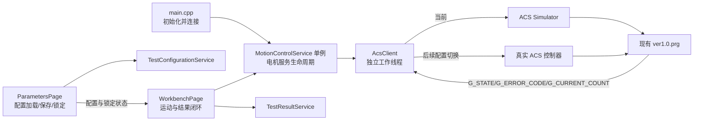
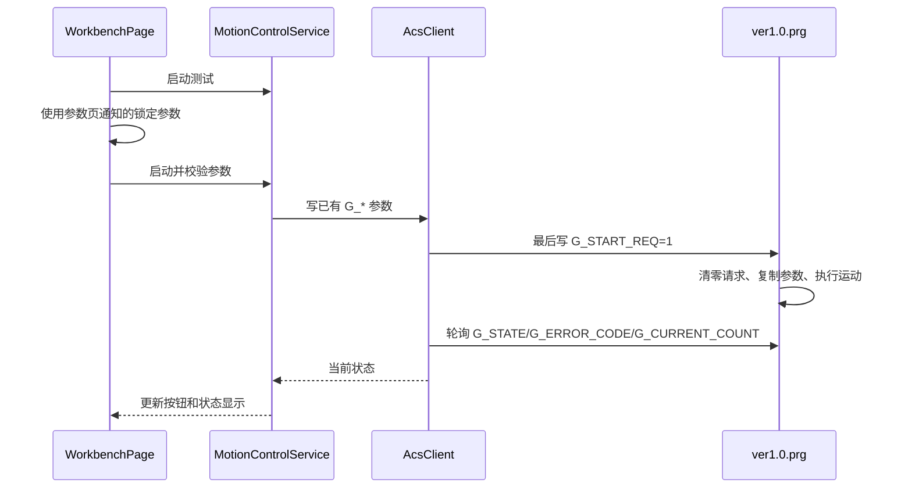

# ACS 运动控制与上位联动模块设计

## 1. 文档状态

- 版本：第 2.5 版，统一两类测试的对称 PTP 参数计算与下发。
- 当前阶段：上位模块已经实现并通过 VS2022 x64 Debug 编译；尚未进入模拟器运行验证。
- 本文只设计上位 ACS 客户端与界面联动，不设计新的 ACS 下位 Buffer 程序。
- 下位交互以 `motorbuffer/ver1.0.prg` 当前已有的变量和状态为准。
- 当前只使用 ACS 模拟控制器；后续通过连接配置切换到真实 ACS 控制器。
- `ver1.0.prg` 未修改；模拟器、应用程序和真实设备均未运行。

## 2. 已确认的设计约束

1. “暂停”按一次终止性中断处理，没有“继续”语义。
2. 中断后的再次启动是一轮全新的测试，不恢复原运动段，也不继承原循环进度。
3. 不设计命令邮箱、命令序号、ACK、参数版本或运行编号。
4. 不增加任何 ACS 全局参数、命令变量或状态值。
5. 只使用 `ver1.0.prg` 已有参数：
   - `G_START_POS`
   - `G_END_POS`
   - `G_TEST_VEL`
   - `G_TEST_ACC`
   - `G_TEST_DEC`
   - `G_REPEAT_COUNT`
   - 已有设备运动参数
6. 上位运动状态只使用 `ver1.0.prg` 已经写入 `G_STATE` 的值。
7. mm 与 ACS count 之间的换算放在 ACS 客户端内，不把换算参数注入 PRG。
8. 本阶段不修改或重新设计下位 Buffer；若现有程序不足以完成中断/停止，先明确告知并等待确认。

## 3. 当前工程事实

### 3.1 上位界面现状

- `WorkbenchPage` 已移除“暂停”按钮，只保留“启动测试”和“停止”。
- 启动通过 `MotionControlService` 和 `AcsClient` 写入现有参数及 `G_START_REQ`。
- 停止通过同一链路写入 `G_STOP_REQ`；其下位效果仍受缺失 Buffer 11 的限制。
- `ParametersPage` 自己维护 `TestConfigurationService`，并把当前展示配置和锁定状态通知工作台。
- `CMakeLists.txt` 已通过 `ThirdParty::acscl` 直接链接匹配架构的 ACSCL import library。

### 3.2 ACS SDK 现状

- 本地 SDK 为 ACS Motion Control SPiiPlus C Library 7.7.0.0。
- 已有 MSVC x64/x86 导入库和 `ACSC.h`。
- 当前 VS2022 x64 构建可使用 `ACSCL_x64.lib`。
- ACSCL runtime 由用户已安装的系统环境变量提供；应用不再执行 `LoadLibrary` 或函数地址检查。
- 模拟器连接使用 `acsc_OpenCommSimulator()`；后续真实控制器使用 Ethernet TCP 连接。

### 3.3 PRG 当前可用接口

`motorbuffer/ver1.0.prg` 当前运动代码位于 `#0`，数据采集位于 `#1`，全局变量声明位于 `#A`。

主程序已经实际使用：

- `G_START_REQ`
- `G_START_POS`
- `G_END_POS`
- `G_TEST_VEL`
- `G_REPEAT_COUNT`
- `G_ZERO_POS`
- `G_N_VEL`、`G_N_ACC`、`G_N_DEC`、`G_N_JERK`
- `G_TEST_ACC`、`G_TEST_DEC`、`G_TEST_JERK`
- `G_STATE`
- `G_ERROR_CODE`
- `G_CURRENT_COUNT`
- `G_ABORT_LATCH`

### 3.4 必须说明的停止处理缺口

当前文件声明并清零了 `G_STOP_REQ` 和 `G_KILL_REQ`，但仓库中的 `#0`、`#1` 没有读取这两个变量的代码。

文件注释说明它们应由“Buffer 11”处理：

- `G_STOP_REQ` 对应 `HALT X`，并设置 `G_ABORT_LATCH = 1`。
- `G_KILL_REQ` 对应 `KILL X`，并设置 `G_ABORT_LATCH = 2`。

但是当前 `ver1.0.prg` 中没有该 Buffer。因此：

- Start 可以依据当前 `#0` 设计。
- 仅向 `G_STOP_REQ` 写 1，按仓库现有代码不会产生停止动作。
- 仅向 `G_KILL_REQ` 写 1，按仓库现有代码也不会产生快速停止动作。
- 上位客户端不能把“变量写入成功”当作“轴已经停止”。

在中断/停止实现前，需要用户确认以下二者之一：

1. 实际控制器中已经存在未纳入仓库的停止监控 Buffer，并将其源码补充到项目；这是推荐方案。
2. 授权对现有 PRG 做最小补齐；该动作属于下位程序修改，需单独设计和确认。

本文不展开 Buffer 11 的实现。

## 4. 总体结构



职责保持简单：

| 模块 | 责任 |
|---|---|
| `main.cpp` | 初始化电机服务、发起 ACS 连接，并在应用退出前关闭服务 |
| `MainWindow` | 只负责界面布局、导航和参数页到工作台的配置通知连接 |
| `ParametersPage` | 闭环完成配置加载、保存、锁定、解锁和页面提示 |
| `WorkbenchPage` | 闭环完成启停、状态显示、结果目标及结果更新 |
| `BottomStatusBar` | 只显示应用版本和当前时间，并自行更新时间 |
| `MotionControlService` | 进程级单例；判断当前是否允许启动/停止，将业务参数交给 ACS 客户端 |
| `AcsClient` | 管理 ACS 连接、单位换算、变量读写和状态轮询 |
| `ver1.0.prg` | 按现有逻辑校验参数并执行运动 |

UI 不包含 `ACSC.h`，不直接持有 ACS `HANDLE`，也不根据按钮点击自行认定运动命令已经完成。

## 5. 上位模块设计

### 5.1 最小文件组织

```text
src/motion/
  MotionControlService.h/.cpp   # 上位联动 API、状态映射和页面通知
  AcsClient.h/.cpp              # ACSCL、工作线程、变量访问和单位换算
config/
  motion.json                   # 连接方式、轴号、轮询周期、count/mm
```

不增加后端工厂、协议对象、命令邮箱类或独立状态机文件。模拟器和真实控制器都使用同一个 `AcsClient`，仅连接方法不同。

### 5.2 上位 API

```cpp
class MotionControlService final : public QObject
{
    Q_OBJECT

public:
    static MotionControlService& instance();

    void initialize();
    void shutdown();

    void connectController();
    void disconnectController();
    void start(const TestParameters& parameters);
    void stop();

signals:
    void connectionChanged(bool connected, const QString& message);
    void motionStatusChanged(const AcsMotionStatus& status);
    void commandFailed(const QString& message);
};
```

服务不提供 `pause()`、`resume()` 或 `interrupt()`；当前 UI 只保留启动和停止。

### 5.3 线程与连接

- ACS `HANDLE` 只在一个专用 `QThread` 中创建、访问和关闭。
- `MotionControlService::instance()` 是进程内唯一电机服务，构造函数不公开。
- `main.cpp` 在窗口完成构造后调用 `initialize()` 和 `connectController()`。
- UI 线程通过 queued signal 调用 ACS 客户端，不执行同步 SDK 调用。
- ACS 客户端串行处理参数写入、命令写入和状态轮询。
- 默认每 50 ms 读取一次关键状态；具体周期可以在模拟器联调后调整。
- 关闭应用时先停止轮询，再调用 `acsc_CloseComm()`，最后结束线程。

### 5.4 连接配置

```json
{
  "schemaVersion": 1,
  "connection": {
    "mode": "simulator",
    "address": "127.0.0.1",
    "port": 701
  },
  "controller": {
    "axis": 0,
    "countsPerMillimeter": 1.0
  },
  "pollIntervalMs": 50
}
```

`countsPerMillimeter` 是上位设备标定配置，不是新增的 PRG 参数。模拟器初始值为 1.0，与当前 PRG 注释使用的 mm 工程单位一致；真实控制器必须替换为机械与编码器确认后的实际值。

连接方式：

| 配置值 | ACS 调用 | 使用阶段 |
|---|---|---|
| `simulator` | `acsc_OpenCommSimulator()` | 当前开发与联调 |
| `ethernetTcp` | `acsc_OpenCommEthernetTCP()` | 后续真实控制器 |

## 6. 只使用现有 PRG 变量

### 6.1 上位写入变量

| 变量 | 用途 | 写入时机 |
|---|---|---|
| `G_START_POS` | 测试段开始位置 | Start 前 |
| `G_END_POS` | 测试段结束位置 | Start 前 |
| `G_TEST_VEL` | 测试运动速度 | Start 前 |
| `G_REPEAT_COUNT` | 完整循环次数 | Start 前 |
| `G_TEST_ACC` | 根据速度和加速距离计算的 PTP 加速度 | Start 前 |
| `G_TEST_DEC` | 与加速度相同的对称 PTP 减速度 | Start 前 |
| `G_START_REQ` | 启动请求 | 所有参数写入成功后置 1 |
| `G_STOP_REQ` | 正常中断/停止请求 | Interrupt 或 Stop |
| `G_KILL_REQ` | 软件快速停止请求 | 顶部软件急停入口 |

不新增 `G_CMD_SEQ`、`G_ACK_SEQ`、`G_PARAM_REV`、`G_RUN_ID` 或新的参数变量。

`G_ZERO_POS`、`G_N_VEL`、`G_N_ACC`、`G_N_DEC`、`G_N_JERK` 和 `G_TEST_JERK` 属于已有设备参数，首版上位测试启动不反复覆盖；它们由控制器工程或后续维护配置管理。

### 6.2 上位读取变量

| 变量 | 用途 |
|---|---|
| `G_STATE` | 当前运动状态，直接按 PRG 已有值映射 |
| `G_ERROR_CODE` | 参数错误、正常停止或快速停止原因 |
| `G_CURRENT_COUNT` | 已完成完整循环次数 |
| `G_START_REQ` | 可选读取，用于确认主程序已经消费启动请求 |
| `G_STOP_REQ` | 可选读取，用于诊断停止监控程序是否消费请求 |
| `G_KILL_REQ` | 可选读取，用于诊断快速停止监控程序是否消费请求 |

本设计不要求 PRG 增加连接状态、ACK 状态或心跳状态。ACS SDK 调用成功与否形成独立的上位通信状态，不混入 `G_STATE`。

## 7. mm 与 count/mm 换算

### 7.1 换算边界

`TestParameters` 继续使用 m、m/s、m/s2。`MotionControlService` 只选择业务字段，不做设备单位换算。所有换算集中在 `AcsClient`：

```text
millimeters = meters * 1000
positionCounts = millimeters * countsPerMillimeter
velocityCountsPerSecond = millimetersPerSecond * countsPerMillimeter
accelerationCountsPerSecondSquared = millimetersPerSecondSquared * countsPerMillimeter
```

如果 ACS 控制器的工程单位已经配置成 mm，而不是 encoder count，则 `countsPerMillimeter` 应明确配置为 1.0；不能在代码中同时进行控制器缩放和客户端缩放。

### 7.2 参数映射

额定速度和不同速度测试使用同一组参数映射：

| 页面参数 | PRG 变量 |
|---|---|
| 开始加速位置 | `G_START_POS` |
| 结束位置 | `G_END_POS` |
| 速度 | `G_TEST_VEL` |
| `repeatCount` | `G_REPEAT_COUNT` |
| `v^2 / (2 * 加速距离)` | `G_TEST_ACC` |
| 与加速度相同的对称减速度 | `G_TEST_DEC` |

配置模块要求总行程不小于两倍加速距离，从而为对称加速和减速各保留完整距离；中间剩余行程为匀速段。

### 7.3 写入规则

1. 在上位再次执行 `validateTestParameters()`。
2. 校验 `countsPerMillimeter` 为有限正数。
3. 完成 m→mm→count 换算并检查结果范围。
4. 依次写入已有运动参数；任何一次写入失败都停止流程。
5. 可选回读关键参数用于诊断，但不维护版本号。
6. 只有全部参数写入成功，最后才写 `G_START_REQ = 1`。

`G_START_REQ` 的最后写入就是当前简单协议的启动边界，不再增加另一套提交机制。

## 8. 使用现有状态

上位不定义新的运动状态，只映射 PRG 中已经实际写入或在状态注释中声明的 `G_STATE`：

| `G_STATE` | 上位显示 | 说明 |
|---:|---|---|
| 0 | 空闲 | 等待启动 |
| 10 | 参数检查 | PRG 正在复制并校验参数 |
| 20 | 轴使能 | PRG 正在使能运动轴 |
| 30 | 运动到零点 | 代码实际写入了 30，虽然文件末尾状态注释遗漏 |
| 40 | 运动到测试起点 | 正常定位段 |
| 50 | 测试运动 | 起点到终点 |
| 60 | 返回零点 | 测试结束后的返回段 |
| 100 | 正常完成 | 当前 PRG 短暂保持后回到 0 |
| -1 | 参数错误 | 结合 `G_ERROR_CODE` 显示原因 |
| -2 | 已中断 | 正常 HALT 后的终止状态，不允许继续 |
| -3 | 快速停止 | KILL 后的终止状态 |
| -4 | 程序异常 | PRG 已声明的异常状态 |

连接中、连接失败等属于 ACS 客户端连接信息，只显示在设备状态区域，不作为新的运动状态值。

`100`、`-1`、`-2`、`-3` 在当前 PRG 中只保持 `WAIT 100` 后回到 0。上位需要同时读取 `G_ERROR_CODE`，并在本地保留本轮最终显示结果；这只是 UI 展示记录，不新增下位状态。

## 9. 上下位交互流程

### 9.1 连接

1. `AcsClient` 根据配置调用 `acsc_OpenCommSimulator()`。
2. `main.cpp` 在主窗口完成构造后初始化电机服务，并立即向 ACS 工作线程排队连接请求。
3. 连接失败时上报 SDK 错误，所有运动按钮禁用。
4. 连接成功后读取 `G_STATE`、`G_ERROR_CODE` 和 `G_CURRENT_COUNT`。
5. 只有 `G_STATE == 0` 且 `countsPerMillimeter` 已配置时允许新启动。

### 9.2 启动



没有 ACK 邮箱。启动请求是否被消费，可通过 `G_START_REQ` 回到 0 或 `G_STATE` 离开 0 判断；超过约定时间仍无变化则上报启动超时，不自动重发。

### 9.3 中断

- 建议将界面按钮文字由“暂停”改为“中断”，避免操作员误以为可以继续。
- 点击后写 `G_STOP_REQ = 1`。
- 中断是终止当前测试：不提供 Resume，不保存待恢复目标点。
- 下位正常 HALT 后应进入已有 `G_STATE = -2`、`G_ERROR_CODE = 2001`。
- 再次点击“启动测试”会从 PRG 的完整起始流程开始，并将完成次数重新清零。

该流程只有在缺失的停止监控 Buffer 已确认存在或获准补齐后才能真正工作。

### 9.4 停止

- 普通“停止”与“中断”都使用现有 `G_STOP_REQ = 1`。
- 两者在下位运动效果上相同，区别只在上位操作记录和结果归类：
  - 中断：操作员主动打断当前试验。
  - 停止：操作员结束当前试验。
- 因为不允许新增命令变量，下位无法区分两种业务原因。
- 停止后不自动回零；这与现有 PRG 的停止处理注释一致。

如果业务不需要分别记录“中断”和“停止”，建议最终 UI 只保留一个“停止”按钮，避免两个按钮执行同一动作。是否合并由用户确认。

### 9.5 软件急停

- 顶部“软件急停”当前只在 `HeaderBar` 内提示尚未接入，不发送设备指令。
- 计划接入时可写入已有 `G_KILL_REQ = 1`，预期下位执行 KILL，并进入已有 `G_STATE = -3`、`G_ERROR_CODE = 2002`。
- 当前仓库同样缺少消费 `G_KILL_REQ` 的程序，未补齐前不能宣称软件急停已生效。
- 软件急停不能代替物理急停、安全门、光幕和硬限位组成的硬件安全链。

## 10. UI 联动规则

| 条件 | 启动 | 停止 | 参数解锁 |
|---|---|---|---|
| ACS 未连接 | 禁用 | 禁用 | 允许 |
| `G_STATE == 0` | 启用 | 禁用 | 允许 |
| `G_STATE` 为 10/20/30/40/50/60 | 禁用 | 启用 | 禁止 |
| `G_STATE == 100` | 等回到 0 | 禁用 | 禁止 |
| `G_STATE` 为 -1/-2/-3/-4 | 等回到 0 | 禁用 | 允许查看错误 |

联动要求：

1. `ParametersPage` 只向工作台通知配置值和锁定状态，不直接驱动设备。
2. `WorkbenchPage` 使用已锁定配置调用 `MotionControlService::instance().start()`。
3. 工作台只根据读取到的 `G_STATE` 更新运动状态，底栏不再显示运行模式。
4. 点击停止后只提示“请求已发送”，不能立即显示“已经停止”。
5. 只有读到 `-2`，或读到 `G_ERROR_CODE == 2001` 后回到 0，才记录本轮已停止。
6. 所有 ACS 读写失败必须在工作台显示 SDK 错误，不能只显示泛化的“操作失败”。

## 11. 模拟器到真实控制器的替换

1. 当前配置 `mode=simulator`，使用 ACS Simulator。
2. 后续改成 `mode=ethernetTcp` 并填写控制器地址、端口。
3. `MotionControlService`、UI、变量名和状态映射不变。
4. 真实设备前重新确认轴号和 `countsPerMillimeter`。
5. 真实控制器上的 PRG 必须与仓库版本一致，并确认停止监控 Buffer 已部署。

不会在应用启动时自动下载、编译或覆盖真实控制器 Buffer。

## 12. Qt 文件日志

- 使用 `QLoggingCategory` 区分 `eddy.application`、`eddy.motion` 和 `eddy.configuration`。
- 使用 `qInstallMessageHandler()` 将 Qt 日志以 UTF-8 追加写入文件，同时保留 Qt 默认调试输出。
- 日志文件位于可执行文件旁的 `logs/高速涡流测试台-YYYY-MM-DD.log`。
- 每条日志包含毫秒时间、级别、线程 ID、分类和源码位置。
- 记录程序启动退出、ACS 服务生命周期、连接结果、运动命令、状态变化、配置加载保存锁定和错误。
- 不记录没有变化的 50 ms 轮询结果，避免持续刷屏。
- 当前按自然日分文件，不实现文件大小轮转或自动清理。

## 13. 实施范围

### Stage 1：上位模块实现与编译（已完成）

- 新增 `MotionControlService` 与 `AcsClient`。
- ACS 模拟器连接方式写入便携版 `motion.json`。
- 在 `AcsClient` 中完成 m/mm/count、速度和加速度换算。
- 使用现有 PRG 参数和状态，不增加协议变量。
- 接入工作台启动、中断、停止和状态显示。
- 接入 ACSCL x64 import library，由操作系统根据 PATH 加载 runtime DLL。
- 接入 Qt 文件日志，不引入 `logger` 目录、spdlog 或其他日志依赖。
- 只编译，不启动应用或模拟器。
- 不修改 `motorbuffer/ver1.0.prg`，直到停止监控程序来源得到确认。

验证结果：`cmake --preset vs2022-x64` 配置成功，`cmake --build --preset vs2022-x64-debug` 编译成功；未启动生成的 EXE。

### Stage 2：模拟器验证

Stage 2 需要另行确认，范围包括：

- 启动 ACS Simulator。
- 加载现有 PRG。
- 验证参数换算、Start 和已有状态轮询。
- 在停止监控 Buffer 确认后验证中断、停止和软件急停。
- 不连接真实设备。

## 14. 当前待确认项

1. 实际 ACS 工程的 `countsPerMillimeter` 是多少；若控制器已经以 mm 为工程单位，请确认是否应配置为 1.0。
2. 实际运动轴是否为轴 0。当前主运动使用轴 0，但采集代码读取轴 2。
3. 注释中提到的停止监控 Buffer 11 是否存在于实际控制器、但尚未放入仓库。
4. UI 是否把“暂停”改名为“中断”。推荐改名，以符合不可继续的业务语义。
5. “中断”和“停止”是否都保留。它们在现有下位变量条件下会执行相同的 `G_STOP_REQ`。

## 15. 验收标准

1. UI 线程不执行 ACS 同步调用。
2. 不增加任何 PRG 参数、命令变量或状态值。
3. Start 的所有参数写入成功后才写 `G_START_REQ = 1`。
4. mm 到 count 的换算只存在于 `AcsClient`。
5. 界面运动状态只来自现有 `G_STATE`。
6. 中断后没有继续入口，再次启动是一轮新测试。
7. 中断/停止在停止监控 Buffer 未确认前不会被标记为已经实现。
8. 模拟器与真实控制器切换不修改 UI 和业务 API。
9. ACSCL runtime 由系统 PATH 在进程启动时解析，不保留应用内动态库检查模块。
10. 未经独立确认不启动模拟器或真实设备。
