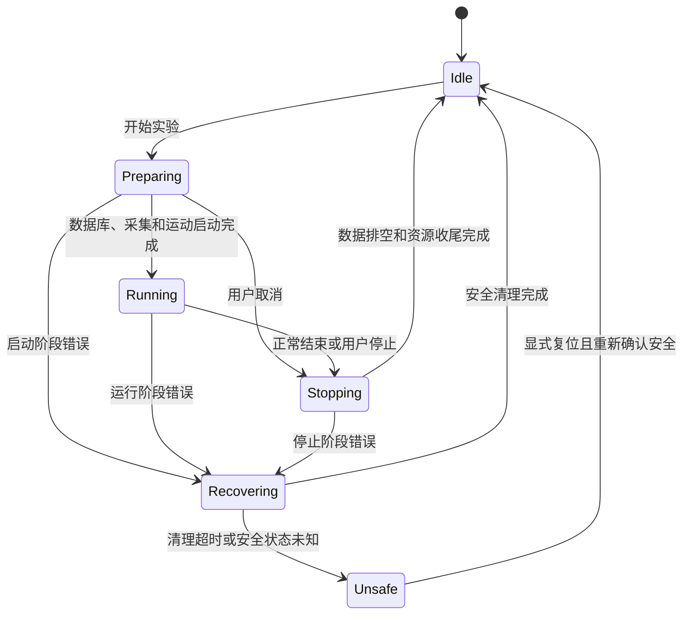

# 实验流程错误恢复与界面状态设计

## 1. 文档定位

本文定义实验启动、采集、运动、数据库写入和停止过程中的错误恢复方案。

本文是待实施的详细设计，不表示代码已经采用该方案，也不表示模拟器或真实设备已经验证。本文不改变急停、安全联锁、限位或控制器内部停止策略。

## 2. 问题描述

当前实现把以下三个概念混合在多组布尔值和永久错误标志中：

1. 某一次异步操作是否成功；
2. 数据库、ACS连接或采集服务当前是否可用；
3. 整场实验处于启动、运行、停止还是故障清理阶段。

由此产生以下问题：

- PostgreSQL建表、写入或查询错误会触发数据库工作线程的永久 `fatalError_`；
- `AcquisitionDatabaseService` 收到错误后把 `ready_` 设置为 `false`；
- 采集错误会使 `DataAcquisitionService` 进入 `Fault`；
- 工作台根据数据库就绪、采集就绪、电机状态和命令等待标志共同推导按钮状态；
- 停止按钮只在电机处于活动状态时启用，建表和采集启动阶段无法取消；
- `TestExecutionService` 发布失败通知时，异步停止和资源清理可能尚未完成；
- 迟到的数据库、采集或运动回调可能属于已经失败的旧实验。

结果是：一次普通软件错误可能同时禁用开始和停止按钮，软件没有明确的恢复路径，只能重启。

## 3. 设计目标

1. 一次实验错误只结束本次实验，不默认破坏整个服务生命周期。
2. 普通建表、写入、采集或命令错误完成清理后必须回到可预测的 `Idle`。
3. 只有外部依赖确实不可用或设备状态无法确认安全时，才禁止再次开始。
4. 停止操作在建表、采集启动和运动运行阶段均可执行。
5. UI只消费统一的流程状态和操作能力，不组合底层模块标志。
6. 所有异步回调均可识别所属实验，旧实验回调不能影响新实验。
7. 错误清理具有明确完成条件和超时路径。
8. 设备安全优先于数据完整性和界面便利性。

## 4. 非目标

- 不使用自动重试掩盖持续存在的数据库、通信或硬件问题；
- 不在本方案中修改控制器急停、限位或安全联锁；
- 不要求错误发生后保留尚未提交的内存数据；
- 不把连接不可用伪装成可重新开始；
- 不允许UI直接管理数据库连接、ACS句柄或采集Buffer。

## 5. 核心原则

### 5.1 错误是结果，不是永久控制状态

建表失败、单块写入失败和采集读取失败都是某次操作的结果。它们可以结束当前实验，但不能直接把服务永久设置为不可用。

服务健康只描述外部能力是否真实存在，例如PostgreSQL连接是否可用、ACS是否连接、设备停止状态是否可确认。

### 5.2 流程状态由一个模块统一拥有

`TestExecutionService` 是实验生命周期的唯一状态所有者，负责协调数据库、采集和运动。子系统只报告命令结果和自身健康状态，不决定工作台按钮。

### 5.3 失败必须先清理，再回到空闲

错误发生后立即通知用户，同时进入 `Recovering`。只有已启动的资源均完成停止或释放后，流程才回到 `Idle`。

### 5.4 无法确认安全时不能假装恢复

如果运动停止、采集关闭或控制器状态在超时后仍无法确认，流程进入 `Unsafe`。该状态需要显式复位或重新连接，不能自动回到 `Idle`。

## 6. 状态模型

```cpp
enum class ExecutionState
{
    Idle,
    Preparing,
    Running,
    Stopping,
    Recovering,
    Unsafe
};
```

状态含义：

| 状态 | 含义 | 是否可开始 | 是否可停止 |
|---|---|---:|---:|
| `Idle` | 没有活动实验 | 由启动能力决定 | 否 |
| `Preparing` | 正在建立实验记录和启动采集 | 否 | 是 |
| `Running` | 运动、采集和数据写入正在进行 | 否 | 是 |
| `Stopping` | 用户正常停止，正在排空和收尾 | 否 | 否 |
| `Recovering` | 错误后正在安全停止和释放资源 | 否 | 否，显示恢复进度 |
| `Unsafe` | 无法确认设备已安全停止 | 否 | 提供复位、重连或安全处理入口 |



## 7. 子系统健康模型

流程状态与子系统健康必须分开。

```cpp
enum class ServiceHealth
{
    Available,
    Unavailable,
    Unknown
};
```

建议维护以下健康信息：

```cpp
struct SystemCapabilities
{
    ServiceHealth database = ServiceHealth::Unknown;
    ServiceHealth controller = ServiceHealth::Unknown;
    ServiceHealth acquisition = ServiceHealth::Unknown;
    bool configurationValid = false;
};
```

健康状态只在以下事实发生变化时更新：

- PostgreSQL连接建立或断开；
- ACS控制器连接建立或断开；
- 采集Buffer是否可访问；
- 配置是否有效并已锁定；
- 设备安全状态是否可确认。

SQL语句失败、数据校验失败或单个采集块失败不能直接改变连接健康状态。

## 8. 实验上下文

每次开始实验生成单调递增的 `executionId`：

```cpp
struct ExecutionContext
{
    quint64 executionId = 0;
    ExecutionState state = ExecutionState::Idle;
    int repetitionIndex = 0;
    bool databaseOpened = false;
    bool acquisitionStarted = false;
    bool motionStarted = false;
    QString failureMessage;
};
```

这些字段只描述本次实验已经获得的资源，用于确定恢复阶段需要释放什么。上下文在返回 `Idle` 时整体清空，不作为永久错误锁。

所有异步结果必须携带 `executionId`，例如：

```cpp
void experimentOpened(quint64 executionId, qint64 experimentId);
void databaseOperationFailed(quint64 executionId, const QString& message);
void collectionStarted(quint64 executionId);
void collectionStopped(quint64 executionId);
void motionStarted(quint64 executionId);
void motionStopped(quint64 executionId);
```

收到回调时必须先执行：

```cpp
if (executionId != context_.executionId) {
    return;
}
```

这样可以安全忽略失败实验产生的迟到通知，不需要使用永久 `fatalError_` 阻塞后续任务。

## 9. 错误分类与处理策略

| 错误类别 | 示例 | 当前实验 | 服务健康 | 最终状态 |
|---|---|---|---|---|
| 输入错误 | 参数越界、配置未锁定 | 不启动 | 不改变 | `Idle` |
| 准备阶段操作错误 | 建立实验记录失败、采集启动失败 | 失败并清理已获得资源 | 原连接仍有效时不改变 | `Idle` |
| 运行阶段操作错误 | 数据写入失败、不可恢复的采集错误 | 停止运动和采集，标记实验失败 | 原连接仍有效时不改变 | `Idle` |
| 连接故障 | PostgreSQL断开、ACS断开 | 失败并尽力安全停止 | 对应服务为 `Unavailable` | `Idle`，但不可开始 |
| 安全状态未知 | 停止命令失败、清理超时 | 禁止继续 | 控制器或采集为 `Unknown` | `Unsafe` |

### 9.1 可恢复数据库操作错误

以下错误终止当前实验，但不把数据库服务永久设置为不可用：

- 建立实验记录失败；
- 插入采样数据失败；
- 单次事务提交失败；
- 实验收尾更新失败；
- 数据格式或采样周期不一致。

数据库工作线程应执行：

1. 回滚当前未提交事务；
2. 清除当前实验的内存写入上下文；
3. 忽略已经排队但仍属于该实验的后续写入；
4. 发布带 `executionId` 的操作失败结果；
5. 保持数据库连接健康状态不变；
6. 下一次实验使用新上下文重新开始。

### 9.2 数据库连接故障

只有连接确实关闭或连接有效性检查失败时，数据库健康才变为 `Unavailable`。界面应显示明确的“重新连接数据库”操作。重新连接成功后健康恢复为 `Available`，不要求重启软件。

### 9.3 采集错误

- 数据块读取前后校验失败属于可重试块错误，保持当前实验运行；
- 序号覆盖、协议异常或通信错误属于当前实验失败，进入 `Recovering`；
- `DCSTART_CON` 已确认关闭且 `DC_ACTIVE_BLOCK == 0` 后，采集服务回到可用空闲状态；
- 如果停止超时或无法读取控制器状态，流程进入 `Unsafe`。

## 10. 统一恢复流程

所有不可继续的实验错误进入统一入口：

```cpp
void TestExecutionService::failCurrentExecution(
    quint64 executionId,
    const QString& message);
```

处理步骤：

1. 校验错误属于当前 `executionId`；
2. 如果已经处于 `Recovering` 或 `Unsafe`，只记录附加错误，不重复启动清理；
3. 保存首个根因并切换到 `Recovering`；
4. 立即发布错误通知，UI显示原因和恢复进度；
5. 如果运动已经启动，优先发送停止意图；
6. 如果采集已经启动，请求停止采集并排空可用尾块；
7. 通知数据库中止当前实验写入上下文，并尽力标记实验失败；
8. 启动恢复超时计时器；
9. 等待运动安全、采集空闲和数据库上下文释放三个完成条件；
10. 全部完成后清空上下文并切换到 `Idle`；
11. 超时或设备状态未知时切换到 `Unsafe`。

恢复过程中数据完整性低于设备安全优先级。数据库故障不能阻止运动停止和采集关闭。

## 11. UI交互模型

UI不得再直接组合 `databaseReady_`、`acquisitionReady_`、`motionState_` 和 `motionCommandPending_` 推导流程状态。

流程服务统一发布：

```cpp
struct ExecutionUiState
{
    ExecutionState state = ExecutionState::Idle;
    bool canStart = false;
    bool canStop = false;
    bool canRecover = false;
    QString statusText;
};
```

按钮只绑定该状态：

```cpp
startButton_->setEnabled(uiState.canStart);
stopButton_->setEnabled(uiState.canStop);
recoverButton_->setEnabled(uiState.canRecover);
```

建议规则：

- `Idle` 且全部启动能力可用：开始可用；
- `Preparing` 或 `Running`：停止可用；
- `Stopping` 或 `Recovering`：禁止重复命令，显示正在停止或恢复；
- `Unsafe`：开始禁用，显示复位、重新连接或人工安全检查入口；
- 数据库不可用但设备已安全空闲：界面保持可操作，开始禁用并显示数据库重新连接入口，不表现为软件卡死。

软件停止按钮不替代实体急停。实体急停和安全联锁不得依赖UI状态。

## 12. 启动时序

```text
用户点击开始
    ↓
校验 state == Idle 和 SystemCapabilities
    ↓
生成 executionId，state = Preparing
    ↓
建立数据库实验上下文
    ↓
启动采集
    ↓
启动运动
    ↓
state = Running
```

任一步骤失败，只清理此前已经成功获得的资源。例如建表失败时还未启动采集和运动，可直接释放数据库上下文并返回 `Idle`。

## 13. 停止时序

用户在 `Preparing` 和 `Running` 均可请求停止：

```text
用户点击停止
    ↓
state = Stopping
    ↓
停止运动或取消尚未执行的运动启动
    ↓
停止采集并排空尾块
    ↓
提交或中止数据库实验上下文
    ↓
清空 ExecutionContext
    ↓
state = Idle
```

停止行为必须幂等。重复停止请求不得重复创建资源、重复结束数据库上下文或触发新的故障。

## 14. 数据库存储目标结构

当前方案为每次重复实验动态创建一张表。该方式使运行时依赖DDL权限，并增加建表失败、表名管理和不完整表收尾的复杂度。

目标方案建议使用固定表：

```text
experiments
├─ id
├─ motor_model
├─ specimen_id
├─ repetition_index
├─ status
├─ started_at
├─ finished_at
└─ error_message

experiment_samples
├─ experiment_id
├─ block_sequence
├─ sample_index
├─ relative_time_ms
├─ acceleration_m_s2
├─ velocity_m_s
├─ motor_current
├─ motor_temperature
├─ force_n
└─ position_m
```

实验状态建议使用：

```text
preparing
running
completed
failed
aborted
```

开始实验只插入一条 `experiments` 记录，不在运行时执行 `CREATE TABLE`。采样数据使用 `experiment_id` 关联。错误发生时尽力把实验状态更新为 `failed` 或 `aborted`，已经提交的数据继续保留用于追溯。

固定表结构属于后续数据库迁移目标，不是本轮错误恢复的实施前提。第一阶段可以保留现有逐实验表，同时先实现统一状态和可恢复错误语义。

## 15. 模块职责调整

### 15.1 `TestExecutionService`

- 唯一拥有 `ExecutionState` 和 `ExecutionContext`；
- 生成并校验 `executionId`；
- 协调启动、停止、错误恢复和超时；
- 向UI发布统一操作能力；
- 不持有数据库连接或ACS句柄。

### 15.2 `AcquisitionDatabaseService`

- 管理数据库线程和连接健康；
- 接收带 `executionId` 的实验操作；
- 区分操作失败与连接故障；
- 提供中止当前实验上下文的幂等命令；
- 不决定UI按钮和整场实验状态。

### 15.3 `DataAcquisitionService`

- 管理采集会话和块连续性；
- 区分可重试块拒收、实验级采集失败和连接不可用；
- 停止完成后恢复到明确的空闲状态；
- 无法确认安全停止时报告不可恢复状态。

### 15.4 `MotionControlService`

- 提交运动开始和停止意图；
- 发布控制器状态和命令结果；
- 不决定实验流程是否结束。

### 15.5 `WorkbenchPage`

- 只发送开始、停止、恢复或重连意图；
- 只根据 `ExecutionUiState` 更新界面；
- 不直接组合数据库、采集和运动内部标志。

## 16. 必须保持的不变量

1. 同一时刻最多存在一个活动 `ExecutionContext`。
2. `Idle` 状态下不得残留活动运动、采集或数据库写入上下文。
3. `Running` 状态必须已经建立数据库上下文并启动采集。
4. 新实验不得接受旧 `executionId` 的任何异步结果。
5. 操作错误不得直接把健康连接标记为不可用。
6. 连接不可用不得伪装为普通操作错误。
7. `Recovering` 只有安全清理完成后才能进入 `Idle`。
8. 恢复超时必须进入 `Unsafe`，不得自动解锁开始按钮。
9. 停止和中止命令必须幂等。
10. UI状态不得成为设备安全判断的唯一依据。

## 17. 分阶段实施建议

### 阶段一：统一状态和错误语义

1. 在 `TestExecutionService` 中引入 `ExecutionState` 和 `executionId`；
2. 提供统一的 `failCurrentExecution()` 和恢复超时；
3. 数据库区分操作错误与连接故障；
4. 采集停止确认后从实验级错误恢复为空闲；
5. UI改为消费统一操作能力；
6. 停止按钮覆盖 `Preparing` 和 `Running`。

### 阶段二：异步结果隔离和幂等中止

1. 数据库、采集和运动回调携带 `executionId`；
2. 增加数据库实验上下文中止命令；
3. 对迟到回调、重复停止和清理超时建立自动化测试。

### 阶段三：固定数据库表迁移

1. 创建 `experiments` 和 `experiment_samples`；
2. 将运行时建表改为插入实验记录；
3. 增加实验状态和失败原因；
4. 制定旧逐实验表的数据迁移与兼容策略。

## 18. 验证场景

### 18.1 脱机和自动化验证

1. 建立实验记录失败，未启动采集和运动，流程回到 `Idle`；
2. 采集启动失败，数据库上下文被中止，流程回到 `Idle`；
3. 运动启动失败，采集停止并完成数据库收尾；
4. 数据写入失败，运动和采集安全停止，下一次实验可以开始；
5. 数据库连接断开，流程结束且重新连接入口可用；
6. 块校验拒收只触发重试，不结束实验；
7. 不可恢复的采集序号错误进入 `Recovering`；
8. 用户在 `Preparing` 阶段点击停止，可以正常取消；
9. 旧 `executionId` 的迟到回调不改变新实验；
10. 恢复超时进入 `Unsafe`，开始按钮保持禁用；
11. 显式复位并确认设备安全后回到 `Idle`；
12. 连续执行“失败—恢复—重新开始”至少十次，不需要重启软件。

### 18.2 模拟器验证

- 模拟建表、写入和提交错误；
- 模拟采集启动、块覆盖和停止超时；
- 模拟运动启动失败和停止回执延迟；
- 验证按钮状态、错误提示和恢复时序；
- 验证恢复过程中不会启动新运动。

### 18.3 真实设备验证

真实设备验证必须在脱机和模拟器验证通过后单独确认，并明确轴、限位、安全联锁、急停、现场人员和停止策略。真实设备上重点确认恢复超时不会绕过安全条件。

## 19. 验收标准

1. 建表或写入错误后无需重启软件即可再次开始实验；
2. 普通操作错误不会把健康服务永久标记为不可用；
3. 实验活动期间始终存在有效的停止路径；
4. 错误后不会同时出现“开始禁用、停止禁用且无恢复入口”；
5. 设备状态未知时明确进入 `Unsafe`，不会错误解锁；
6. UI按钮状态只来自统一流程能力；
7. 日志可以用 `executionId` 还原一次实验的启动、错误、清理和恢复过程；
8. 迟到异步结果不会污染下一次实验。

## 20. 当前结论

推荐以统一实验状态机作为第一实施优先级，并同时拆分数据库操作错误和连接健康。该方案直接解决界面锁死问题，同时保留工业设备必须显式确认安全状态的约束。

固定数据库表是后续简化运行时数据库生命周期的目标方案，不应与第一阶段状态机修复混为一次未经验证的大改动。
