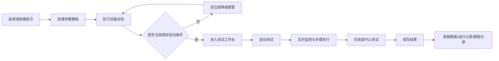

# 高速涡流测试台界面重构说明

> 本文仅基于当前提供的“开始/开机总览”与“测试”两个界面进行分析，不涉及底层控制逻辑、数据协议和硬件选型。

## 1. 重构结论

当前界面的主要问题不是功能不足，而是**同一类信息在多个位置重复出现、主任务与辅助任务混排、页面信息密度过高**。

建议采用以下结构：

- 不强制保留独立“开始”界面。
- 将“测试工作台”设为默认主界面，直接承载实时曲线、测试控制、步骤结果和关键状态。
- “批次管理”“运行记录”“报警记录”分别作为独立导航页面。
- 各类连接状态、传感器状态和安全链状态保留在主窗口，形成统一的“设备状态面板”。
- 顶部只保留项目名称、项目说明和必要的全局安全操作。
- 账户切换、登录状态、权限与退出登录移入侧边栏底部的账户区域。
- 底部状态栏保留，但删除账户登录相关信息。

---

## 2. 当前界面存在的问题

### 2.1 信息重复

以下内容在顶部、开始页卡片、右侧栏和底部状态栏中多次出现：

- 当前用户、登录状态
- 当前批次、批次状态
- 当前测试项、运行状态
- 设备连接状态
- 健康量与报警提示

重复显示会增加视觉噪声，也容易出现不同区域状态不同步的问题。

### 2.2 “开始”界面承担过多职责

当前开始界面同时包含：

- 开机总览
- 批次管理
- 最近批次与记录
- 硬件连接状态
- 开机自检
- 安全链状态
- 关键健康量
- 报警摘要

该页面同时承担了入口页、管理页、自检页和监控页的职责，导致操作目标不明确。操作员进入系统后不容易判断下一步应该先处理批次、参数、自检还是直接测试。

### 2.3 测试界面主次关系不清

测试界面中，实时曲线、控制按钮、准备完成度、测试步骤、运行记录、设备状态和报警记录同时争夺注意力。

其中“运行记录”属于追溯信息，不应长期占据主测试区的大块空间；“准备完成度”更适合在测试前检查阶段显示，测试开始后应自动收起或转换为运行状态摘要。

### 2.4 多层滚动区域过多

右侧状态栏、报警栏、批次列表、运行记录、硬件连接和自检区域均存在内部滚动。多个局部滚动条会造成：

- 用户难以判断当前滚动对象
- 重要故障可能被折叠在不可见区域
- 触控或低分辨率场景下误操作概率增大

### 2.5 顶部区域过高且混入操作功能

顶部同时放置了项目说明、当前用户、登录状态、批次状态、切换登录、软件急停和刷新曲线。

其中：

- “刷新曲线”应属于实时曲线工具栏。
- “切换登录”应属于账户管理。
- “批次状态”应属于当前任务上下文或批次管理。
- “软件急停”是全局安全操作，可以保留，但需要独立、固定、明显，不应与普通按钮并列。

---

## 3. 是否需要独立“开始”界面

### 推荐方案：不设置强制独立开始页

对于单台测试台、固定操作流程的场景，登录后直接进入“测试工作台”更高效。系统可以在工作台顶部展示当前任务、当前批次和自检结果，使操作员无需经过一个只做跳转的页面。

### 可保留“概览”页的条件

只有在以下场景中，独立概览页才有明显价值：

- 同时管理多台测试设备
- 班组交接需要查看整机概况
- 主管用户主要查看状态而不直接操作
- 需要汇总当日产量、故障、批次和设备利用率

若系统目前只服务一台测试台，建议移除“开始”，将其功能拆分到对应页面；未来确有管理需求时，再增加“概览”导航，而不是继续使用当前的混合式开始页。

---

## 4. 建议的信息架构

```mermaid
flowchart TD
    A[测试工作台] --> A1[实时曲线]
    A --> A2[控制与执行]
    A --> A3[测试步骤与结果]
    A --> A4[当前报警摘要]
    A --> A5[设备与传感器状态]

    B[参数设置] --> B1[试验参数]
    B --> B2[控制参数]
    B --> B3[阈值与联锁]
    B --> B4[配置模板]

    C[批次管理] --> C1[新建/编辑批次]
    C --> C2[批次启用与完成]
    C --> C3[批次归档]
    C --> C4[批次关联试验]

    D[运行记录] --> D1[控制动作]
    D --> D2[流程节点]
    D --> D3[状态变化]
    D --> D4[导出]

    E[报警记录] --> E1[当前报警]
    E --> E2[历史报警]
    E --> E3[确认与处理]
    E --> E4[筛选与导出]

 
```



### 推荐主导航

1. 测试工作台
2. 参数设置
3. 批次管理
4. 运行记录
5. 报警记录


“帮助”可放入侧边栏底部或账户菜单，不必占据一级高频导航位置。

---

## 5. 整体布局建议

```text
┌──────────────────────────────────────────────────────────────┐
│ 项目名称 / 简短项目说明                       全局软件急停   │
├──────────────┬───────────────────────────────┬───────────────┤
│ 左侧导航栏   │ 主内容区                      │ 设备状态面板  │
│              │                               │               │
│ 测试工作台   │ 实时曲线                      │ 安全链        │
│ 参数设置     │ 控制与执行                    │ 控制器/通信   │
│ 批次管理     │ 测试步骤与结果                │ 传感器        │
│ 运行记录     │                               │ 当前报警摘要  │
│ 报警记录     │                               │               │
│ 数据         │                               │               │
│              │                               │               │
│ ───────────  │                               │               │
│ 用户/权限    │                               │               │
│ 切换账号     │                               │               │
│ 退出登录     │                               │               │
├──────────────┴───────────────────────────────┴───────────────┤
│ 状态 | 批次  | 版本 | 时间 │
└──────────────────────────────────────────────────────────────┘
```

### 布局原则

- 左侧导航宽度固定，可折叠。
- 账户管理固定在左侧栏底部，与业务导航分离。
- 右侧设备状态面板在所有核心操作页面保持一致。
- 主内容区只显示当前页面的核心任务。
- 避免在一个页面内出现三个以上独立滚动区域。

---

## 6. 测试工作台设计

### 6.1 页面组成

测试工作台建议保留以下四个主要区域：

1. **当前任务条**
   - 当前测试项目
   - 当前批次
   - 当前试验件
   - 当前运行阶段
   - 参数锁定状态

2. **实时曲线**
     暂留空白

3. **控制与执行**
   - 自动/手动模式
   - 启动测试、暂停、停止
   - 加载/卸载驱动使能
   - 回零、零位校准
   - 单步前进、单步后退

4. **测试步骤与结果**
   - 当前步骤高亮
   - 已完成步骤折叠
   - 失败步骤显示原因与处理建议
   - 关键结果卡片

### 6.2 运行记录处理

运行记录不再占据测试工作台的大块区域。

建议在工作台中只显示最近 3～5 条事件，并提供“查看全部”入口，完整记录进入独立“运行记录”页面。

### 6.3 准备完成度处理

“准备完成度”仅在测试尚未开始时显示。

测试启动后，该区域转换为：

- 当前阶段
- 已运行时间
- 当前步骤
- 剩余步骤
- 是否存在降级或告警

---

## 7. 设备状态面板

设备连接状态和传感器状态应保留在主窗口，但需要统一组织，避免分散为“硬件连接”“开机自检”“安全链”“关键健康量”等多个重复卡片。

### 7.1 分组方式

#### A. 安全链

- 急停回路
- 机械硬限位
- 软件限位
- 光幕
- 防护门
- 超速监测
- 驱动器故障链

#### B. 控制与通信

- 实时总线主站
- 拖动电机驱动器
- 数据采集模块
- 上位机与控制器通信
- 编码器或位置反馈

#### C. 传感器与辅助系统

- 电机温度传感器
- 力传感器
- 气浮台压力传感器
- 气浮台流量传感器
- 冷却水流量传感器
- 冷却水压力传感器
- 环境温度传感器
- 其他关键模拟量

### 7.2 每个状态项应显示

- 名称
- 当前状态
- 当前数值与单位
- 正常范围或阈值
- 最后更新时间
- 是否参与联锁
- 故障详情入口

示例：

```text
冷却水流量
12.6 L/min
正常范围：10～18 L/min
状态：正常
参与联锁：是
更新时间：10:38:21
```

### 7.3 状态等级统一

建议全系统仅使用以下状态：

| 状态 | 含义 | 建议表现 |
|---|---|---|
| 正常 | 可正常运行 | 绿色 |
| 提示 | 不影响当前运行 | 蓝色或中性色 |
| 预警 | 接近阈值，需要关注 | 黄色 |
| 故障 | 已越限或设备异常 | 红色 |
| 离线 | 无通信或无数据 | 灰色 |
| 未启用 | 当前配置不使用 | 浅灰色 |

红色只用于故障、急停和必须立即处理的状态，避免普通按钮或非关键提示滥用红色。

### 7.4 自检方式

自检不必单独占据一整块长期显示区域。

建议提供“执行自检”入口，自检结果直接回写到设备状态面板：

- 全部通过：显示“自检通过”
- 存在提示：允许测试，但明确提示
- 存在联锁故障：禁止启动，并显示具体阻断项

---

## 8. 批次管理页面

批次管理应独立成页，避免与开机总览混排。

### 核心功能

- 新建批次
- 编辑批次
- 保存草稿
- 启用批次
- 完成批次
- 归档批次
- 复制已有批次
- 关联试验件、委托单、电机型号和配置模板
- 查看批次下的试验次数与结果
- 导出批次数据

### 页面建议

左侧为批次列表，右侧为批次详情。顶部提供状态筛选：

- 草稿
- 进行中
- 已完成
- 已归档

当前测试工作台只显示已选中的批次摘要，不在工作台中直接编辑完整批次信息。

---

## 9. 运行记录页面

运行记录独立成页是合理的。

### 记录范围

- 登录后关键操作
- 参数加载与锁定
- 自检执行与结果
- 模式切换
- 启动、暂停、停止
- 回零、校准、使能切换
- 测试步骤开始与结束
- 状态变化
- 数据保存与导出

### 推荐字段

- 时间
- 操作员
- 事件类型
- 操作对象
- 操作内容
- 执行结果
- 关联批次
- 关联试验
- 详细信息

支持按时间、批次、操作员、事件类型和执行结果筛选，并支持导出。

---

## 10. 报警记录页面

报警记录独立成页是必要的。

### 主窗口保留内容

主窗口右侧只保留：

- 当前未恢复报警数量
- 最高报警等级
- 最近 1～3 条报警
- “查看全部报警”入口

### 报警页面功能

- 当前报警与历史报警切换
- 按等级、设备、传感器、时间和处理状态筛选
- 报警确认
- 恢复时间记录
- 处理备注
- 关联运行记录
- 报警导出

### 报警生命周期

```text
触发 → 活动中 → 已确认 → 已恢复 → 已关闭
```

“确认”不等于“故障消失”，界面必须区分报警是否仍处于活动状态。

---

## 11. 顶部区域调整

顶部只保留：

- 项目名称：高速涡流测试台
- 一行项目说明
- 固定的软件急停入口

建议移除：

- 当前用户卡片
- 当前登录卡片
- 批次状态卡片
- 切换登录按钮
- 刷新曲线按钮
- 重复的当前测试项与运行状态标签

其中：

- 用户相关操作移入侧边栏账户区。
- 刷新曲线移入实时曲线工具栏。
- 当前批次和运行状态移入测试工作台的当前任务条。
- 软件急停保留为全局固定操作，并与普通按钮拉开视觉层级。

---

## 12. 侧边栏账户管理

账户管理建议位于左侧导航栏底部，默认只显示：

- 用户姓名
- 当前角色
- 权限等级

展开后提供：

- 切换账号
- 锁定界面
- 修改密码
- 查看权限
- 退出登录

账户操作不应占据顶部主视觉区域，也不应在底部状态栏重复显示。

---

## 13. 底部状态栏

底部状态栏应保留，建议包含：

- 系统当前模式：待机、准备、运行、暂停、故障
- 当前测试项目
- 当前批次
- 当前配置文件
- 控制器或网络地址
- 数据归档路径
- 软件版本
- 系统时间

建议移除：

- 操作员
- 当前登录状态
- 切换账号相关信息

操作员信息可通过侧边栏账户区查看；必要时可在运行记录中自动记录，但无需持续占用状态栏。

---

## 14. 当前元素迁移建议

| 当前元素 | 建议位置 |
|---|---|
| 开机总览 | 删除，内容拆分 |
| 批次管理 | 独立“批次管理”页面 |
| 最近批次与记录 | 批次管理或运行记录页面 |
| 硬件连接状态 | 统一设备状态面板 |
| 开机自检与提醒 | 设备状态面板中的自检功能 |
| 安全链状态 | 固定设备状态面板 |
| 关键健康量 | 固定设备状态面板 |
| 报警栏 | 主窗口显示摘要，完整内容进入报警记录页 |
| 运行记录 | 主窗口显示最近几条，完整内容进入运行记录页 |
| 当前用户/登录 | 侧边栏账户区 |
| 刷新曲线 | 实时曲线工具栏 |
| 软件急停 | 全局固定安全操作 |

---

## 15. 建议的测试工作流



这一流程应由系统状态引导，而不是依赖操作员在多个卡片之间自行判断。

---

## 16. 优先级建议

### 第一阶段：结构调整

- 移除或弱化“开始”页
- 新增批次管理、运行记录、报警记录独立页面
- 简化顶部区域
- 将账户操作移入侧边栏
- 清理底部账号信息

### 第二阶段：状态统一

- 合并硬件连接、自检、安全链和健康量
- 统一状态等级、颜色和文案
- 建立传感器阈值、联锁和更新时间展示规则

### 第三阶段：测试工作台优化

- 收缩运行记录
- 优化实时曲线工具栏
- 按测试阶段动态显示准备度或运行进度
- 减少页面内部滚动条

### 第四阶段：追溯与导出

- 完善批次、运行、报警和试验结果之间的关联
- 增加统一筛选、导出和回放能力

---

## 17. 验收标准

重构后应满足：

- 操作员登录后最多两步即可进入可启动测试状态。
- 同一状态只在一个主位置展示，其他位置只提供必要摘要。
- 主测试界面不出现批次编辑、完整运行日志或完整报警历史。
- 所有参与联锁的传感器均可快速定位当前值、阈值和故障原因。
- 任意故障从主窗口最多一次点击可进入详细信息。
- 账户操作不占用顶部和底部业务状态区域。
- 页面主要内容在常用分辨率下尽量避免纵向整体滚动。
- 所有状态颜色和等级全系统一致。

---

## 18. 最终建议

当前系统更适合采用“**测试工作台为核心、管理功能分页面、设备状态常驻、账户操作侧边收纳**”的结构。

独立“开始”页不是必须项。若没有多设备总览和管理驾驶舱需求，建议直接取消；将登录后的默认页面设为测试工作台，并通过当前任务条和设备状态面板完成进入测试前的引导。

---

## 19. UI 代码连接规范

- 按钮、工具栏 `QAction`、输入控件等 UI 对象的交互信号直接连接页面逻辑时，必须使用具名成员槽函数，不得在 `connect` 中使用 lambda 表达式隐藏处理逻辑。
- 槽函数在类头文件的 `private slots:` 或 `public slots:` 中显式声明，命名优先采用 `on<Object><Signal>`，例如 `onStartButtonClicked()`。
- 动态生成的 UI 控件需要额外参数时，优先通过控件属性、按钮组 ID 或类成员状态传递，再由具名槽函数统一处理。
- 非 UI 直接交互的参数适配、异步回调或对象生命周期回调可使用 lambda，但处理逻辑较长或可复用时仍应拆分为具名成员函数。
